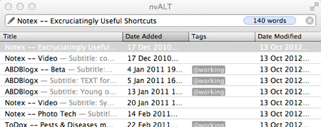

Funny how things work. Patrick Rhone recently celebrated the [8th anniversary of his ongoing relationship with Notational Velocity](http://patrickrhone.com/2013/03/25/apps-that-stay-notational-velocity/), a mind-bogglingly simple, and even more powerful, piece of software that just keeps everything I want findable. Like Patrick, I too use [nvALT, the modern incarnation of Notational Velocity](http://brettterpstra.com/projects/nvalt/), every single day, and wouldn't be without it. In fact, it is what keeps me from even trying sexier solutions like Evernote. So I got to thinking: when did I discover NV? Maybe NV has the answer. But no.

{.center}

Switching to nvALT and viewing the Date Added column (I normally don't show it, useless information) suggests my earliest note -- actually the one provided by NV's Zachary to speed its use -- is from December 2010. But I suspect that's when I discovered nvALT and moved everything over. At least, I think so. And since that time I've adopted a few additional tweaks to add a little more obvious order to the pile of notes.

So when did I get it? Probably after Patrick, and in any case this isn't a competition, it's a concerted admiration effort. I certainly [wrote about it in 2007](https://www.jeremycherfas.net/blog/my-shameful-secret-toolbox-love/), and have delivered on my desire then to "make it routine". What's funny about that list of software, though, is that although I have changed the tools, the jobs, as ever, remain the same.

* [Bookends](http://www.sonnysoftware.com/) is still my bibliographer.
* WriteRoom has vanished, to be replaced by [ByWord](http://www.bywordapp.com/).
* [Clyppan](http://www.omh.cc/Clyppan-Clipboard-Manager-for-the-Mac/) replaced PTHPasteboard, which succumbed a couple of OS updates ago.
* And [MarsEdit](http://www.red-sweater.com/marsedit/) replaced ecto a while ago too.

I never did get around to either Quicksilver or DevonThink, and as far as I know I don't miss them. My other discovery is Markdown, which I think is what sent me to nvALT. That too is starting to become part of muscle memory, though needs a bit more work. The next tool I most feel the lack of is TextExpander, and I wouldn't be surprised to have it to hand within a month.[^1]

[^1]: I did, and I use it a lot. Also Alfred. But especially with TextExpander, I know I'm not using it to the full, with all those fancy bits for doing things with the clipboard. Still, I love both of them too.