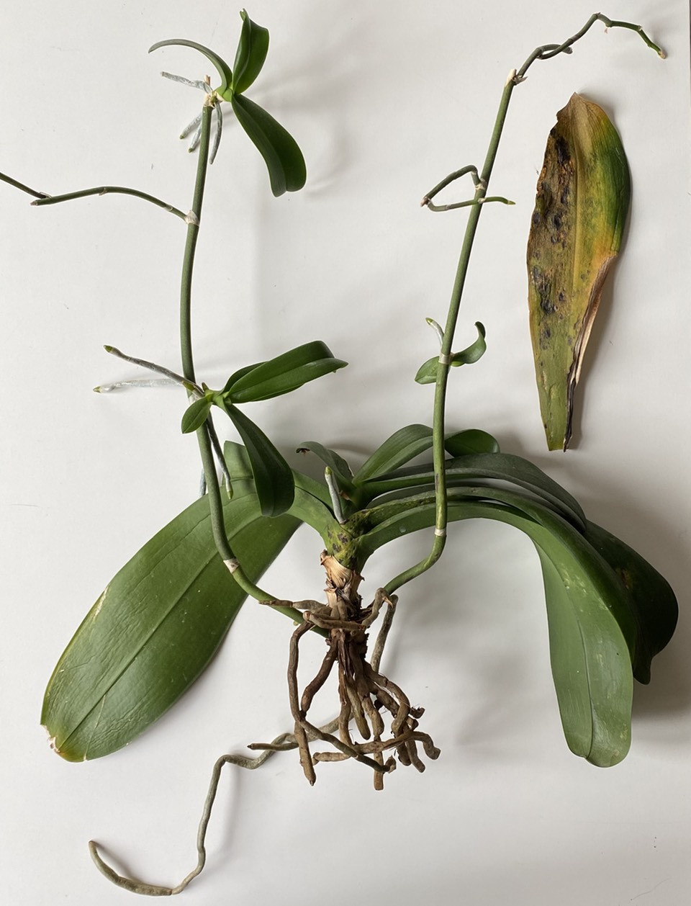
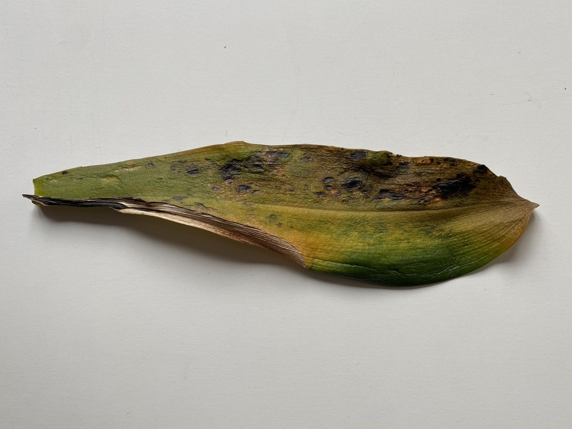
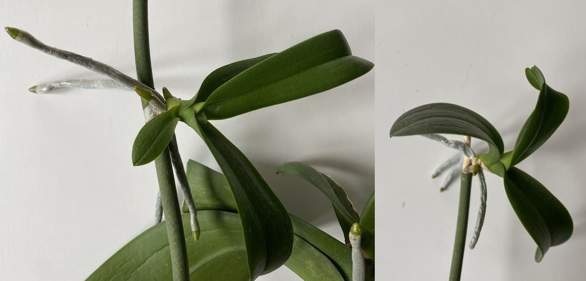
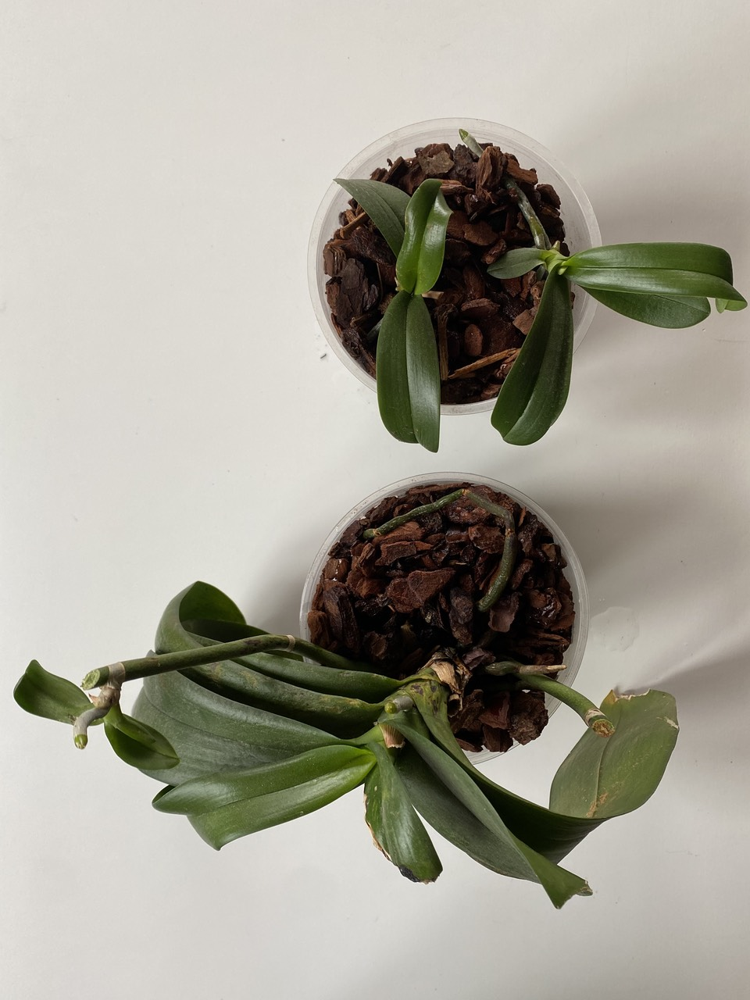

[{.center}](orchid-1-2021-05-01.jpeg)

The wait is over. After soaking in weak tea for seven days, my one remaining Phalaenopsis orchid is looking a little less ropy. In fact I was exceedingly pleased this morning that the one particularly daggy leaf came away in my hands. I had feared that I might have to cut if off, risking disease and death. Now I’m thinking that maybe the tea treatment gave the plant the strength to withdraw what it could from the leaf and seal it off with a nice corky abscission scar.

===

[{.center}](orchid-5-2021-05-01.jpeg)

The entire process started when The Black Thumb (_aka_ Terry Richardson, [orchidwhisperer19](https://www.instagram.com/orchidwhisperer19/) was on Jane Perrone’s On The Ledge podcast. He has a [YouTube video](https://youtu.be/Bf86hDck_YQ) showing his rescue technique, which involves weak tea made with distilled water. His explanation — that the tannin in the tea stimulates the plant into growth in the same way that tannin dissolved in rainwater trickling down a tree trunk would — made sense. 

The orchid wasn’t doing well, I could see that. Before I threw it out, it seemed worth a tea bag and a week to see whether it might improve.

[{.center}](sm-orchid-3-4-2021-05-01.jpeg)

Now here I am, ready to pot it on. I had to watch a couple more videos to get a rough idea of what to do with the babies, which I learned are called *keikis*. In the end, I decided to sacrifice the spike that the two big babies were growing on, the one on the left in the big photo. It was a bit spindly to begin with and it didn’t seem worth risking cutting the keikis free. The third keiki I left to grow on, but cut the spike above it.

So here we are. Three plants, and although the parent still has problems, I am more confident that I won’t have to dump it just yet.

[{.center}](orchid-6-2021-05-01.jpeg)

And speaking of dump, armed with my new-found knowledge, I’m going to be on the lookout for discarded orchids to rescue.
