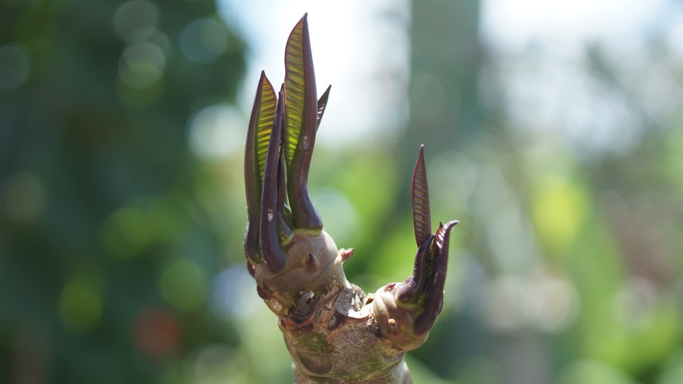
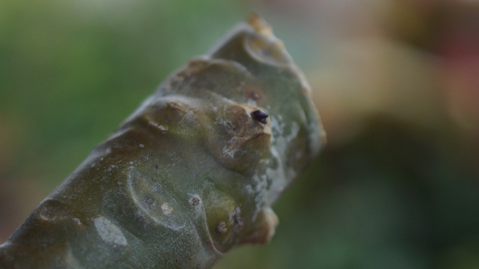
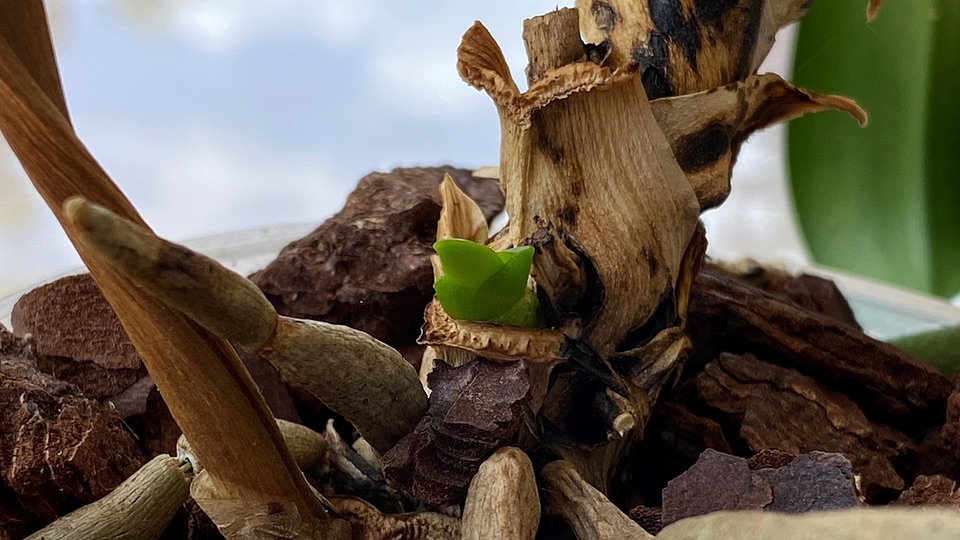
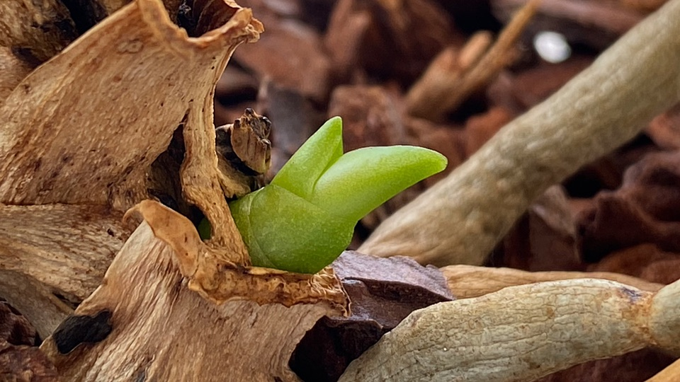

[{.center}](frangipan-3-lg.jpg)

This has been a good week for excellent news on the plant front, quite apart from no deaths taking place while we were away. An orchid and the big frangipani are showing renewed signs of life.

===

Frangipani (_Plumeria_ spp) have very strong [apical dominance](https://en.wikipedia.org/wiki/Apical_dominance), meaning that each branch grows almost entirely from its tip, with no side branching. Occasionally one of the tips will divide into two or three and those then set off on their own, but there’s no bushiness about a frangipani. That’s why I was very dismayed to report in April that despite having shrouded the branch ends in fleece over winter, most of the tips seemed to be dead; where would new growth come from? A month later, I pruned every branch back to a point where it seemed healthy enough and oozed latex from the cut. One tip seemed undamaged; I left that. Before we went away, about a month after pruning, there seemed to be no change in anything, except the cuts had scarred over. 

[{.center}](frangipan-2-lg.jpg)

When we returned there were leaves emerging from the unharmed tip and definite signs of some swelling of the lateral axillary buds and, with the eye of faith, maybe even some leaf primordia.

I’m extremely happy and anxious to see what develops.

[{.center}](orchid-2-lg.jpg)

In addition to that, a tiny green shoot on the [revived moth orchid](https://www.jeremycherfas.net/blog/repotting-my-revived-moth-orchid), which at first I thought was “just” a new root, turned out to be a shoot. I’ve never had a flower spike grow from scratch, so I don’t yet know whether that’s what it is, but even if it is another plant, I shall be very satisfied.

[{.center}](orchid-1-lg.jpg)