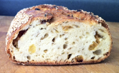
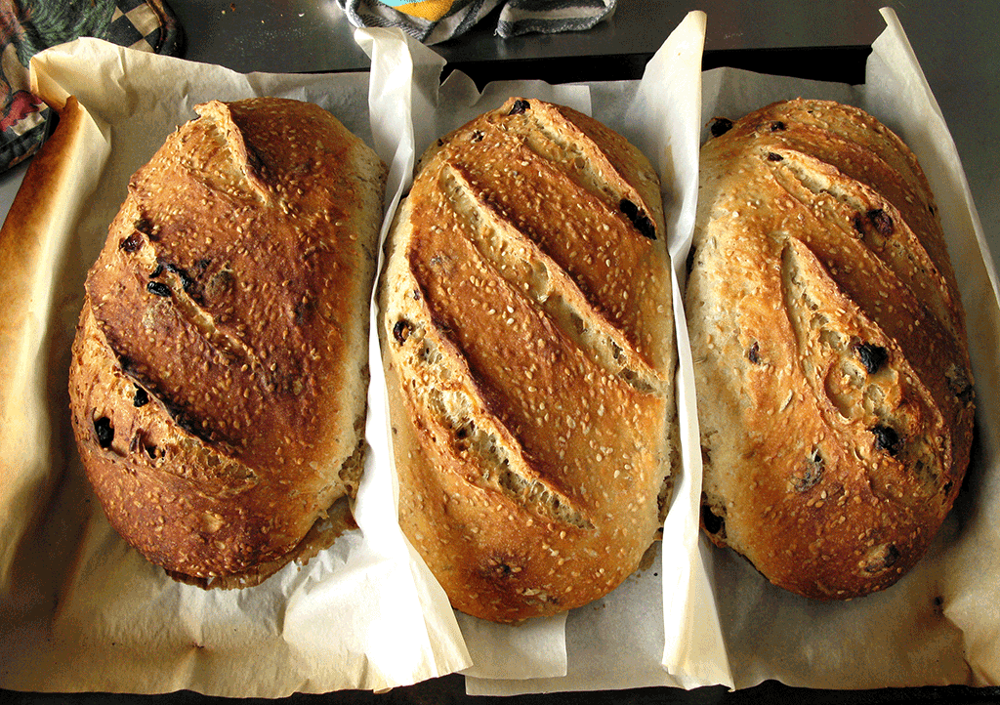
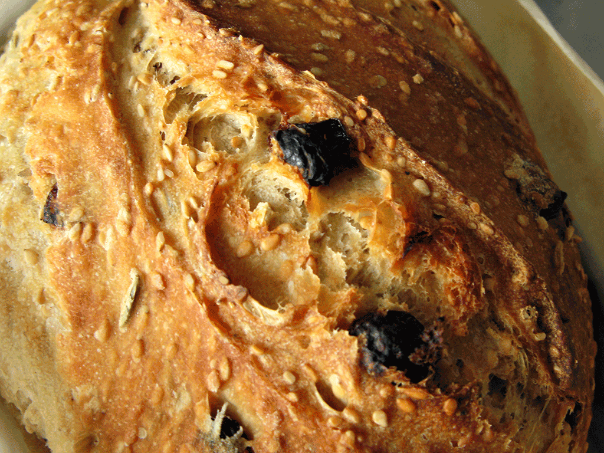
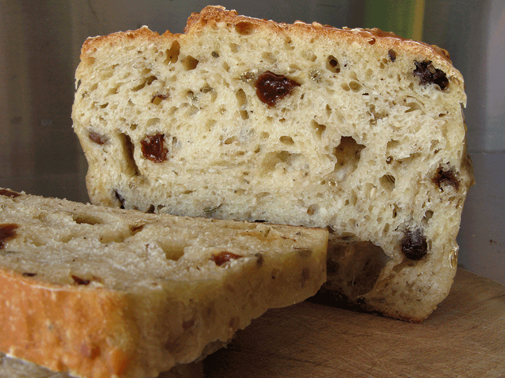
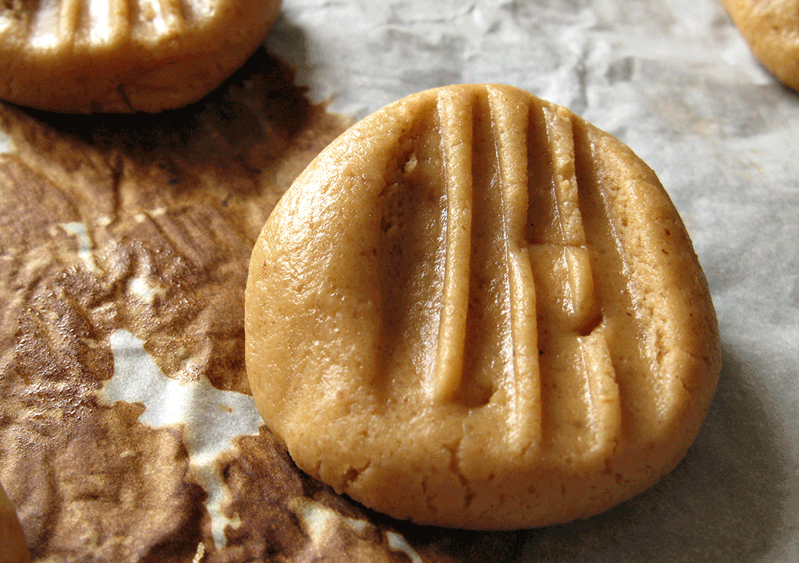
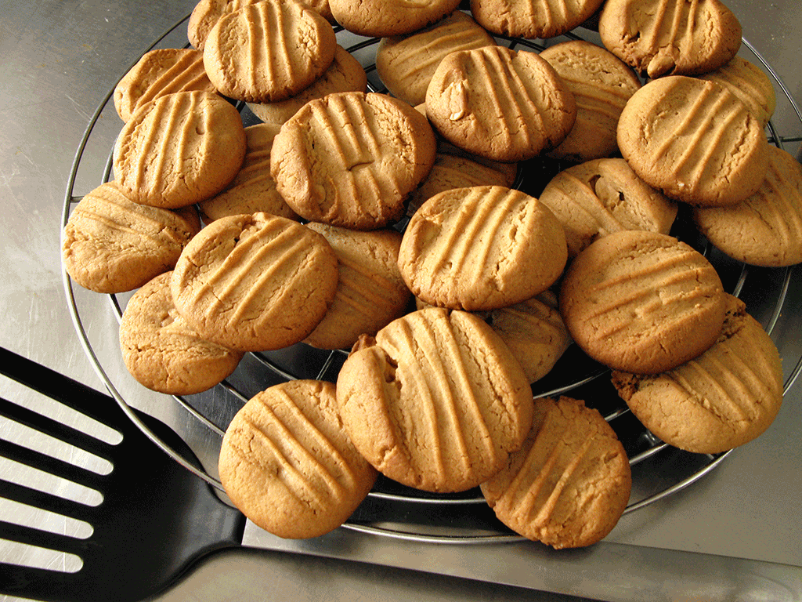

My breadchum Joanne took off for New York a couple of weeks ago, and before she left I persuaded her to lend me Hamelman's _Bread_ to plunder. The first thing I did from it was a Semolina Bread with a soaker and fennel seed, made with commercial yeast. It was really good, and I planned to convert it to my 100% white leaven this weekend. Then came news from Joanne. She’d been to some out of the way bakery and bought a loaf of Semolina, sesame, fennel, raisin bread that was to die for etc etc, and could I make it.

”Did you get a recipe?”  
“No, but I'll send you a photo.”

{.left} And there it is. Two things struck me. First off, those raisins look like the gemlike giant golden sultanas that the spice shop down in Trastevere has. Secondly, how hard could it be to add raisins and sesame to the Hamelman loaf I had made a couple of weeks ago, while converting it to a leaven? So I read a few other Hamelman recipes that featured raisins, and they were generally around 20% to 30% of the flour weight. I decided to halve that. We didn’t actually have any of the gemlike giant golden sultanas in the house, an oversight to be sure as I laid my plans for this weekend’s baking, but fortunately the new owners of the supermarket up the road see no reason, unlike their predecessors, to shut on Sundays in Lent, the godless capitalist swine. A quick expedition later, I was ready to begin.

## Ingredients

```
200 grams sesame seeds
250 ml hot water for the soaker
300 grams ripe 100% white flour starter
600 grams durum flour
250 grams strong flour (Manitoba)
125 grams raisins
15 grams fennel seeds
20 grams salt
420 ml water
```
## Method

Prepare the soaker by pouring the hot water over the sesame seeds. Set aside for at least 30 minutes.

Mix the starter with 420 ml water (final hydration is hard to be exact about, because the sesame seeds take up some of the soaker water, but it is around 75%) and then add the rest of the ingredients. Stir well to incorporate most of the ingredients then tip out onto the counter and do a couple of stretch and folds to mix and wet all the ingredients, squishing any lumps.

At this point the dough is sticky without being gluey; it scrapes off the fingers easily, and doesn’t leave much behind on the counter. I kneaded swiftly for about one minute, which was a little difficult as raisins kept shooting out all over the place. One final fold then back into the bowl for bulk fermentation of about 3 hours, with a couple of stretch and folds every hour.

At the end of the bulk ferment the dough was pretty light and still sticky but not gluey -- Post-it notes rather than [Cow Gum](https://web.archive.org/web/20080219033044/http://www.davidthedesigner.com/davidthedesigner/2007/02/whatever_happen.html). I divided it into three 730 gram pieces, shaped them into rounds and rested them for about 15 minutes. Then shaped into loaves and placed onto a jury-rigged tin lined with parchment paper because they seemed too soft to handle after resting either on a couche or in bannetons. Second rise of 90 minutes.

I toyed with sprinkling extra sesame seeds on top and decided against it. They just get everywhere. Hamelman has a good technique for getting seeds to stick to the outside of a loaf. Wet a tea towel and place it on the counter. Then lift the proved loaf and invert it onto the tea towel and then into a tray of seeds. It works well too, but not with very soft loaves. So, no seeds. Just a quick slash and into a hot oven at 230°C with steam. After 20 minutes, I removed the water pan and turned the oven down to 210°C for another 20 minutes.

{.center}

Even I was not prepared for the golden deliciousness that emerged from the oven. I took them off the parchment paper and gave them another 5 minutes to dry the sides a little. And the taste was pretty stupendous too, though I say so as shouldn’t; the nuttiness of the sesame, the fragrance of the fennel, and by luck or judgement a frequency of raisins that resulted in a savoury loaf with minor gouts of sweetness rather than a sweet loaf.

{.center}

No idea what Joanne’s original tasted like -- I’ll have to wait for her return -- but I’m pretty proud of this result. Proud enough to send it to [Yeastspotting](https://www.wildyeastblog.com/category/yeastspotting/).

{.center}

I also baked some Peanut Butter Cookies.

{.center}

{.center}

Recipe (adjusted) from the dear old [Joy of Cooking] ~~http://www.thejoykitchen.com/recipe.lasso?recipe=1145&menu=one~~.[^1]

[^1]: Sadly now apparently defunct, but the recipe is all over the shop online.

