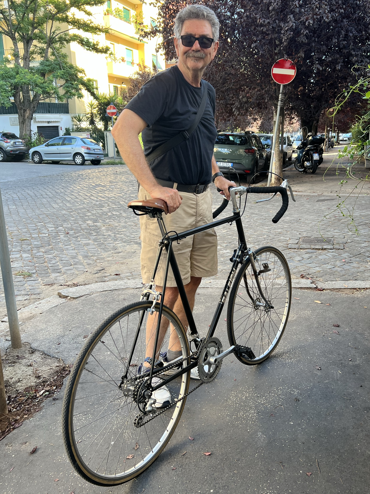
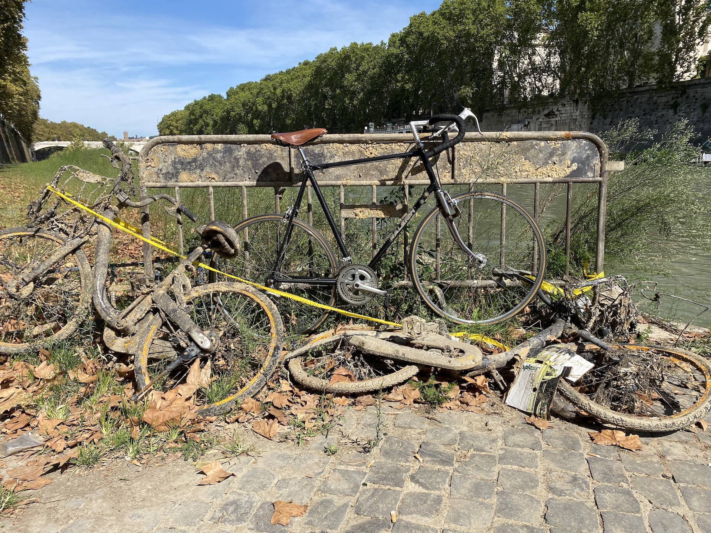

Today was a great day. I went out for a proper first ride on the finally finished tear-down and refurb of my fabulous old Raleigh, a shade over [six months after I started](https://www.jeremycherfas.net/blog/re-cycling).

{.center}

===

On Saturday night I did a very minor spin around the parking lot to establish that it was rideable, as a result of which I had to tighten the rear axle again and adjust the brakes. That done, off I set this morning.

First stop was the owner of the LBS who managed to get the stem and the seat post out of the frame, [back in May](https://www.jeremycherfas.net/blog/raleigh-restoration-report). He was gratifyingly pleased with what I had done, and reassured me that the paint job was completely acceptable. It isn't, the fine white lines of undercoat showing through cracks annoy me intensely, but it was nice of him to say so. I had hoped he would have a nice set of leather straps for the toe-clips, but all he had was nylon and I prefer the extra rigidity of leather. He and his mucker took turns picking it up (13 kg) and nostalgically asking to fiddle with the friction shifters on the down tube.

That done I headed on down the cycle path by the Tiber, and it was so great to be just tooling along. It is hard to describe why that bike brings such joy. It isn't just the long-term satisfaction of having taken it down to the bare ball bearings and brought it back together again, though that is very considerable. It is more a feeling of efficiency that I just do not get to the same extent on either of my other bicycles. Some of that is mechanical efficiency, I'm sure. Being lighter it is just more responsive. Some of it may be imagined, half-remembered weaving through London traffic and the rest of it. But there is also something about, to be a bit poncy, the man-machine interface. It just fits. Drops make it so easy to shift the position of my hands, the suicide brake extensions allow me to slow down a little, if need be, without grabbing the brake levers proper. It all just works.

This idle reverie was rudely interrupted by a slight nagging clunk from the right crank. That's the one that is 5 mm longer than it ought to be, and that I never did bother to replace. I still can't feel it, although I do notice that the toe-clip on that side is more likely to drag. Anyway, it got so I had to stop to take a look, and sure enough, the crank bolt had come loose. This was a problem, because although I had brought an adjustable spanner with me just in case, it really required a socket. The spanner was no help.

I dithered a bit, trying to decide between going back to the LBS (the shame of it) and riding on, when I realised I was actually very close to Porta Portese which, if you've seen Vittorio de Sica's glorious *Ladri di biciclette* you will know is just the place to get a bicycle fixed. I walked up there, found an old bloke and he saw me right with a proper socket and a very large wrench.

Onwards! Not that far, only about 10km to The Squeeze where, I'm happy to say, she and a mutual friend were available for an early lunch/late breakfast. On the way I passed a perfect photo op.

{.center}

Back home, another 10 km, and I staggered myself by making it up the long, slow hill without having to walk at all.

The satisfaction is so good, even though I know I could have done more and better. I did enough. A new right crank might happen one day. The friction shifters are fine, and it didn't take long to get back in the swing of things, though it is confusing that both move in the same direction to change up and down. What I mean is that on the hybrid bike, the right hand shifter, for the rear derailleur, goes forward for down and backward for up. The left shifter, for the front derailleur, is reversed, forward for up and backward for down. I'm sure I will get used to the difference soon enough. 

I haven't put the mudguards back on because I have not been able to source the little bolts that hold the stays on. Not sure about that. I don't plan to ride in the rain, but even going through a puddle can be awkward. So that's one to look out for. 

I will put the rear carrier back. It is handy to be able to carry a few things without them being in a bag slung around my back, and it does offer a little puddle protection.

The only major parts I replaced were the stem, seat tube and saddle and, of course, cables, brake blocks and chain. I'm not even sure there is anything I particularly want to upgrade. I hear good things about [Silver shifters](https://www.rivbike.com/products/z4449999jz-lsdkj). That's probaby number one on my wishlist. And I will definitely upgrade the cables when the time comes. Other than that, I am content.

Was it worth it? Of course it was. Yeah, I spent more money than I originally expected to, though I haven't added it all up. I have a good guess though, and where else would I find a bike like that, in my size, for less than €200?

