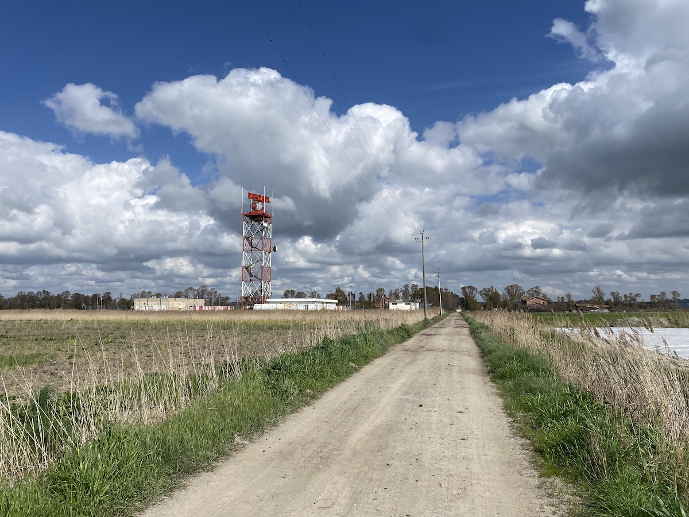
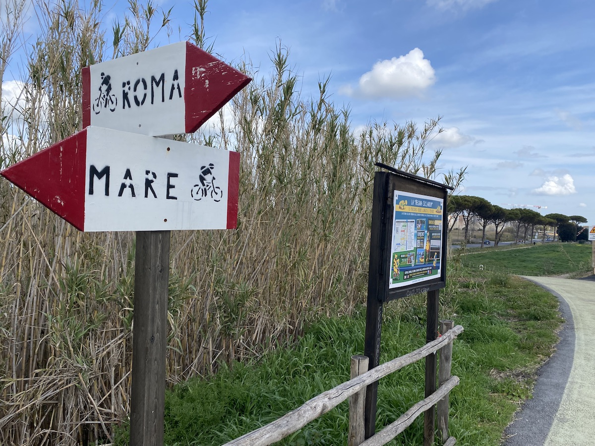

{.center}

Last week, in an effort to keep riding my bicycle for fun outside the city, I put myself in the hands of Komoot. The app allows you to plan your own rides and use (and modify) rides that Komoot itself or other members have created and saved. It also offers a kind of online diary in which you can share photos and add comments about them.

===

I chose a loop from a station I am very familiar with out round the airport and back. I know many of the roads, it is all quite level, and I thought it would make a good starter tour. It did.

Komoot's voice commands are much better than both OSM and Google, giving much better notice and, I think, with much greater accuracy. No complaints (aside from pronounciation, obvs).

The route it chose was also pretty good, apart from one very difficult stretch near the start. A track along a field was very narrow, with drop-offs of around 15 cm on both sides that meant I really had to concentrate. The exit from that stretch back onto the road had a chain across it, easily overcome, but still. I feel that whole segment could do with a warning.[^1]

[^1]: I have read that Komoot is quite adventurous on the "bike touring" level, but I have not had occasion to see how "road cycling" would differ. If it keeps me off main roads and silly little paths but lets me ride on gravel and white roads, that'll be the one for me.

I took my first rest and water break about 55 minutes in, after about 14 km. Just before that, I saw something slip into a drainage ditch just behind a large commercial park. Bigger than a rat, smaller than a beaver (Duh!), I think it must have been a nutria. During the rest, I tried to do something about the fact that Komoot was not working on my watch. It kept shifting back to the workout on Activity. I remembered seeing something about Komoot communicating with the Health app, so I gave Health permission to read workouts and heart rate from Komoot and stopped the workout.

That was a mistake for my obsessive self-quantified soul, because as I discovered later I had omitted to give Komoot the go-ahead to send that information to Health. All I need to do now is to remember to add the extra kilometers to the monthly total. Next time, all should be good without Activity having any say in the matter.

There's not a lot to say about the ride. At one point, the route went onto a track between vegetable fields covered with plastic fleece to protect the carrots growing in the incredibly light, sandy soil. Alas, the track consisted of incredibly light, sandy soil and I was simply unable to move forward. I doubled back and continued on the road until I was able to pick up the route again. It's a bit disconcerting to have Komoot insist repeatedly that I must make a U-turn, but being familiar with the road I carried on until it realised the error of its ways.

There were some great long straights, very zen, one of about 4km on a cycle path by the side of the airport and another of about 7km along a somewhat potholed white road beside a drainage ditch, which offered some interesting wildlife including a couple more nutria. I also spotted a small raptor hovering over a bit of rough grazing, but the drawback of being on a bicycle is that one doesn't want to keep stopping all the time just to check out the wildlife. In future I think I'll plan rest stops where I can sit and observe quietly.

Summing up, as a ride it was good fun; not too taxing and no climbs or descents to speak of, just a nice, gentle pedal. Komoot did a good job on navigation though there was that one rough segment. I will certainly use it for future excursions. As a diary, Komoot has some good features, like being able to drag my photos to position them on the map.[^2] There doesn't seem to be a way to include the kind of narrative I've written here, which seems a shame, but I can at least embed some of the photos or a map of the route, and if you click on that it will take you to my record of the tour on Komoot.

Of course, what all that really makes me want to do is up my own indieweb narrative mapping game. I'm recording all the data, and can easily create a static map of a route. But I cannot, yet, add photos or notes to the map. I've read lots of blog posts and tutorials on the subject, and it doesn't seem **too** difficult, but ...

[^2]: But then, what happened to the lat-long in the photo metadata? Something to investigate. Maybe it gets lost when I save the HEIC as JPEG?
