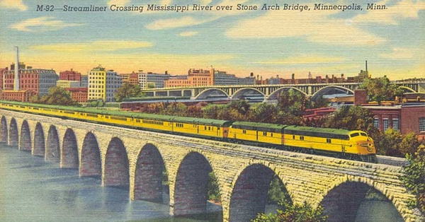

{.center}

Stone mills served us well in the business of turning grain into flour for thousands of years, but they couldn’t keep up with either population growth or new and better wheat. The roller mill came about through a succession of small inventions and the deep pockets of a few visionary entrepreneurs. They turned Minneapolis into the flour capital of the world.

<a href="https://www.eatthispodcast.com/our-daily-bread-17/" rel=canonical>Listen to Rollin’ rollin’ rollin’ at Eat This Podcast.</a>