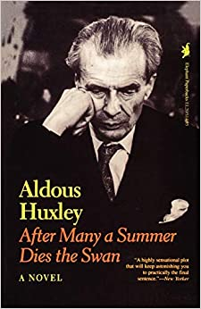

{.left} San Luis Obispo is close to my heart, and not just because of Aldous Huxley's entertaining  [After Many A Summer Dies the Swan](https://bookshop.org/a/13377/9781566630184), which informed my own thinking about neoteny and such. So it was fun to receive an email from a friend containing a clever letter to the editor of _The Tribune_ in that far-away town.

In essence, it said -- rather wittily -- that as those who don’t believe in evolution do not believe that bird ’flu will mutate, there’s no need to waste vaccine on them.

But email stories that ought to be true have a way of propagating that far outstrips their actual truth. So I had a little poke around. I think the original may, or may not, have come from a blog called scifiheaven. [The poster said:](https://scifiheaven.net/2005/11/avian-flu-vaccine-evolution/)

> Doing my usual browse of the internet today, I stumbled across an interesting letter sent to the editor in the San Luis Obispo (CA) paper.

And he copied the letter in full, with a generic link to _The Tribune_’s front page. But when I actually went looking for the letter, I discovered that it was signed by someone completely different.

Scifiheaven’s copy (and the one I got through email) is signed [George R Zug](https://web.archive.org/web/20051111154626/http://www.nmnh.si.edu/vert/reptiles/reptiles-research.htm), Divis. Amphibians & Reptiles, mrc162, Smithsonian Institution, PO Box 37012, Washington DC 20013-7012.

The Tribune’s original letter [Some don't need vaccine](https://web.archive.org/web/20060217010118/http://www.sanluisobispo.com/mld/sanluisobispo/news/editorial/letters/13097574.html) (you have to scroll down) is signed Steve Anderson, Arroyo Grande.

I take that as definitive. (Well, wouldn't you?) So, my question: who’s plagiarising whom?
