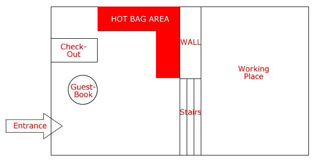
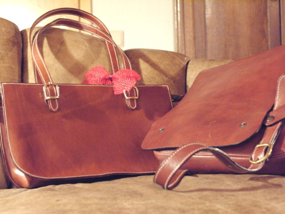

I opened an email one day about a month ago from someone I didn’t know. He said he thought I was in Rome, and could I do him a favour. Instead of telling me the whole story -- why reinvent the wheel? -- he just pointed me to a [discussion] ~~http://discuss.joyent.com/viewtopic.php?id=18726~~[^1] on a bulletin board. I popped over.

[^1]: Long dead, like the “lifetime service” they originally sold many of us.

There, he explained that he and his girlfriend had been in Rome a couple of months before and they had gone into a little leather shop downtown. Ralph bought himself a bag. The girlfriend also really liked one of the bags, but couldn’t afford it. With Christmas coming up, Ralph thought he would surprise her with it. [^2]

Ralph contacted the shop and discovered that they didn’t do mail order, not under any circumstances. He knew what he wanted and wrote them attractive emails, all to no avail. So he did what any sensible person would do; he asked his friends.

His friends in this case were the thousands of people who frequent the support forums of Textdrive.com, a hosting company that supplies the nuts and bolts of websites such as my blogs.[^1] Which was why I was a member of the support forums. The community is a tremendous source of, well, support, but because things had been going rather smoothly for a good long while I hadn’t actually seen Ralph’s original cry for help. Textdrive’s is a global community, and there was at least one other person in Italy, but he is in Milan. Everyone wanted to help Ralph and his girlfriend but couldn’t, until someone remembered that I was in Rome.

{.center} 

Ralph emailed me via the board, and I was delighted to help, mostly to prove that cyber-communities are like real communities. As a first move, you can trust your friends and their friends. Ralph told me where the shop was with a Google Maps reference and sent a schematic of where the bags were in the shop. I knew it anyway, and wasn’t at all surprised that the girlfriend had fallen for one of their bags. But which one? I agreed to go and photograph all the bags, which had to wait a day or two. Meanwhile, Ralph emailed the shop to prepare them for my coming. I got to the shop, took the pictures, emailed them to Ralph. Next day he replied, a red circle round the desired bag.

My printer is not yet unpacked, so I memorized what I could of its look and its position -- low down, on the right, next to the belts -- and the next day, being Saturday, The Squeeze and I walked into the shop. I looked at the shelves, low down, next to the belts. Aaargh! It wasn’t there. And I hadn’t brought the computer with me. Of course not; I knew exactly where the bag was. And now it wasn’t. Perhaps that was it over there in a completely different spot?

The woman in the shop recognized me as the lunatic from the day before.

“You moved the bags.”  
“Yes, of course. We move them very day. To clean.”  
“I wanted the bag that was there yesterday. Is that it there?”  
“I think so, yes.”  
“That's the one my friend wants me to buy. I really need to be sure. I don’t want to make a mistake.”  
“No, that's the one that was there.”

Convinced, mostly, and with no real desire to go home, get the laptop, bring it down and examine the photo with the red circle together, I handed over the cash and headed to the Post Office. Which was closed for the feast of the Immaculate Conception.

Hey ho. On Monday I posted the bag. Tuesday the following week Ralph emailed that it had arrived. He asked what he owed me. I told him. About six minutes later I got an email from PayPal that the money had arrived. Ralph shared the news and a photo with the bulletin board, which promptly went into a round of well-deserved self-congratulatory back-slapping.

{.center}

I spent the next three weeks away from all internets (which was nice) fretting occasionally that it was the wrong bag. I needn’t have worried.

Ralph emailed me, “the bag was absolutely right, and she is very happy with it. It’s her favourite bag now, and she has got plenty of them…” That’s it up there, with the festive bow, nestling alongside Ralph’s somewhat butcher effort from the same shop. And I feel good about having been able to help someone.

I’m telling this story not because I am such a fabulous human being, but because I think it does indicate that there’s no difference between cyberspace friends and meatspace friends. It was because I knew Ralph from the bulletin board, and knew that I could trash him there if he proved untrustworthy, that I undertook the task. I’d have done the same for any friend of a friend, and have done. But had someone just emailed me out of the blue, with no prior connection between us, I would have been reluctant to the point of refusing.

It occurred to me, also, that this kind of mutual reciprocity could actually be the basis of a website itself, a place where people could ask other people to shop and despatch for them. I offered the idea gratis to the Rails gurus over at Textdrive. So far, alas, shop4u.com has not actually materialized. But I live in hope.

[^2]: An aside, girls: this is exactly the sort of not-so-subtle clue that enhances the whole present-buying business.
