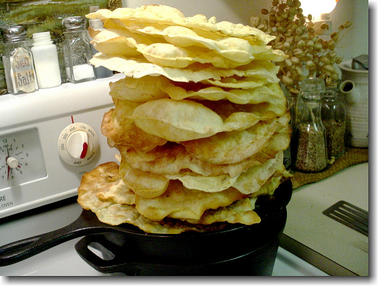

{.center}
[Great little video](http://www.isresardegna.it/index.php?xsl=585&s=64396&v=2&c=4259&t=1) showing how they make traditional Sardinian pane carasau, also known as carta da musica. Unfortunately, I can't seem to embed the video here. 

*P.s.* 28 December 2017: Worse, it seems to require Flash. [Image from flickr](http://farm3.staticflickr.com/2693/4077220230_0b16649ae8_q.jpg); the drop shadow was not my idea.