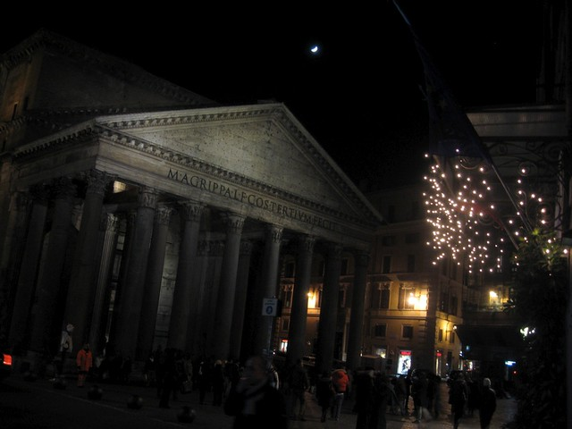

{.center}

Saturday night, on the town. An early [movie](http://jeremycherfas.net/blog/a-goliath-of-a-film/), then a stroll through the centre of the city to an English pub where a friend’s band is to play later that night. Much later, it turns out. They are scheduled for 9.30, which suggests 10.30 will be nearer the mark. It is only 7.30. Normally it’d be easy to spend a couple of hours wandering around, but this evening it is butt-freezing cold, so I decide to wait it out in the pub, people watching.

Among the people, a young couple. He is wearing a [Crombie](https://www.crombie.co.uk/), or similar.[^fn1] She is rather plump, blond, the kind of woman of whom my mother would say, “She could be very attractive if she’d just make a bit of an effort”. And they’re there together, having a quiet drink, chatting, laughing, a bit of a snog from time to time. Nice.

Except that then they have another drink. And another. He’s on pints. She's on something and Coke. Through a straw. And now the snogging gets a bit heavy, pseudo lap-dancer stuff. Just a laugh. And he’s trying to engage the lads, who are watching Lazio Juve on the huge screen, in a bit of idle insultery. And another. By now, she’s really not too well. She gets up. Collapses back down. Emotions flit across her face. He tries to help. She gives him an earful, stands, and wobbles off to the bathroom. He sits, tries again to engage the lads, she returns.

He buys her a single rose. She slaps him with it. Playfully? They haggle awfully with an instant photograph man. Time passes. Juve go up. Now she’s trying to stand again, and he’s helping her, and together they go outside into the freezing cold. Maybe she throws up. Who knows? But they come back in, sit back down, seem friendly again. She orders another something and Coke. And he doesn’t put up any obvious objections. She sucks at the straw, concentrating mightily, until at some point, with plenty left in the glass, she just seemed to run out of steam, batteries spent. They sat, silent, morose, side by side and slack, until he made a decision, bundled her up and bundled her out into the cold. They missed the band.

I hate to say this, but I actually felt slightly ashamed to be English. There were lots of other ex-pats in the pub that night, but most of them seemed local rather than tourists, and behaved accordingly. This couple, however, just wouldn’t give up. They were on holiday having A Good Time by doing just what they might have done had they not been on holiday. And I suspect that they weren’t actually having that good a time.

[^fn1]: And I am amazed to find, on researching this piece, that there doesn’t seem to be anything on the web about the Crombie as style marker, a gap that must be filled, but I do not have the expertise. 
