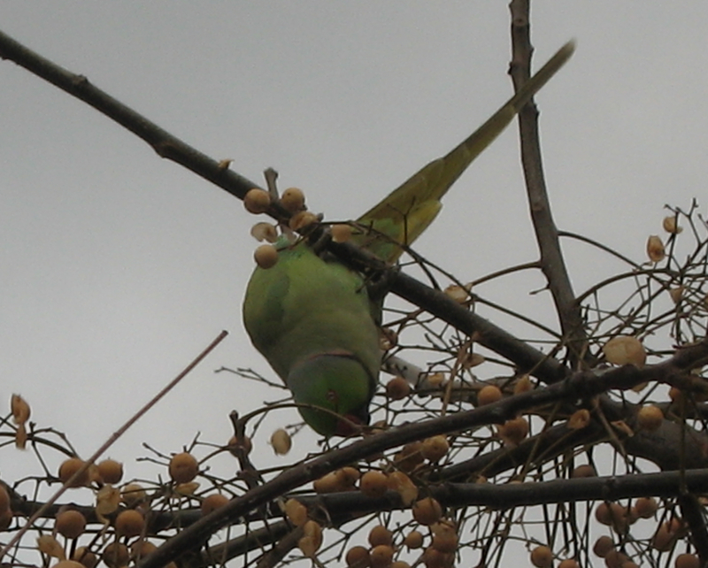

{.center}

I stepped off the bus a couple of days ago and heard the unmistakeable screech of the invisible parakeet. In the Villa Pamphilij and elsewhere I’ve caught glimpses of them flitting high overhead through the umbrella pines. One memorable evening, just after we had moved in here, I happened to be looking out the window when a squadron came through tight and low and fast and vanished between the two buildings opposite. But I’ve never really **seen** them. This time was different. A minor flockette had landed in the little street trees (a _Sorbus_?) and the birds were behaving just like they ought. I mean, hanging upside down, doing severe damage to the fruits, clucking and clicking,  flashing their wings at one another, walking crabwise along the branches, the whole parakeet thing.

The camera was in the bag, and before long the snaps were in the camera. Nothing too special, but good to have. And looking on the big screen, I’ve a feeling they may be ring-necked parakeets, but only because they have a ring around their necks and that’s one of the kinds said to be at loose here.

!!! 2022-02-24: These days, 14 years later, they’re bloody everywhere, bold as brass. But still a treat to see up close.
