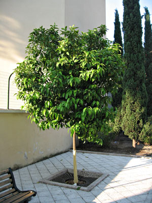
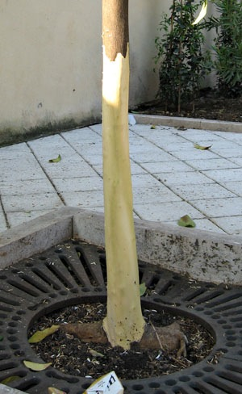

{.center}

I am incredibly angry. Actually, I’m resigned, but who writes because they’re resigned?

On the way to work each morning I generally take a short-cut through a modern church down the road. It's an unlovely church, but skipping through it shaves five minutes off the walk and sometimes affords amusement at the pagan antics. About ten days ago they started cleaning up the church grounds, slashing a load of nettles, cleaning out the broken glass and weeds, sticking a few shrubs around the place. They’ve put some beautiful roses among the Portuguese laurels at the front. Nice.

This morning I noticed something funny about one of the orange trees just outside the church. that’s it up there. Can you see it? Some farquad had stripped the bark from the trunk. All the way round: ring-barked. I swear, I was speechless with rage. I had time to check it out, and there were no signs of clawmarks or teethmarks or anything animal that might excuse it. And I had time to take that photograph, and the next one that shows the damage in more detail.

{.center} 

This was a deliberate act of -- what? Vandalism? Stupidity? Boredom? Revenge? Impossible to know. And impossible to know whom to blame. My first thought is that one of the east European rough types who hang around there drinking and smoking and playing cards might have done it. I’ve heard that they sleep rough in the church grounds, and perhaps the tidying up has displaced them. But is that any reason to sentence a tree to death? It could be idle yoof, but I’ve never seen any lollygagging in that particular spot. Maybe the east European types scare them. Full fledged Italian *dietrologia* would probably construct a scenario in which disgruntled ex-communist gardeners have a master plan to bankrupt the new fascist city government by making them spend a fortune on replanting city trees.

Rome is maddening at times, a raddled old tart who really doesn’t care what she looks like because the punters will pay whatever. Perhaps in addition to cleaning up vagrants and undesirables the new government will also imprison spray-painters for life and cut the goolies off litterbugs. It’d be a start, and would give me pause for thought if it actually started to improve life in the city. Could one learn to like that? I don't know.

I do know that I’m going to have to see that tree every morning. And that makes me very angry.
