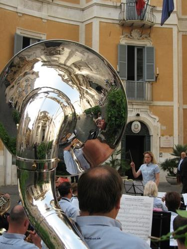

{.left} It had been a long, besuited day. I escaped and, being downtown already, wandered off in search of amusement. And then, as I was walking down towards the Piazza di Sant’Ignazio, I heard music. Not standard street-busker fare, but something nostalgic, something essentially English. [A brass band](crawley.m4v). Playing show tunes. Right in front of the carabinieri station and opposite [Sant’Ignazio](https://en.wikipedia.org/wiki/Sant'Ignazio) with its wonderful anamorphosed dome. I was, in the argot, gobsmacked.

I fell into conversation with an English woman who belonged to the band and who quickly disabused me of my preconceptions. It was, in fact, a wind band not a brass band. And although she was from Yorkshire, the band was not. It was the [Crawley Millennium Concert Band](http://www.cmcband.co.uk/). What were they doing in front of the cop-shop, I asked. Alas, I made no notes, but from memory someone in the band was related to someone at the British Embassy, who knew (was married to?) someone in the carabinieri, who set that gig up. And the embassy connection was the real reason the band was in Rome, to play the Queen's Garden Party.[^fn1] I commented that a female conductor must be pretty unusual. Oh yes, my informant explained, and her Dad was in the band too, and she was married to someone in the band, and that was her baby crawling around behind and applauding like mad at the end of each tune. I couldn’t follow the details, I confess, but the web site is very helpful:

> Sally Hartley is the Director of Music. Sally is a local musician who has lived in Crawley for over 20 years. She teaches woodwind for West Sussex Music Support Service. Sally is the married to Andrew, the band's principal trumpet player and Vice Chairman. Sally's father, John Fisher is Chairman and plays bass clarinet. Sally and Andrew celebrated the birth of their daughter this year. Sally's mother, Jackie is band secretary.

It must have been Jackie I was talking to. Thank you Jackie, for pointing out that I had dropped my camera bag.

On I went, towards The Pantheon, when what should assail my ears but [yet more show tunes](carabinieri.m4v). This time it was the cops themselves, although exactly which division of policitude I cannot be certain. The ones with white pith-helmets. I think that’s the Polizia. Anyway, I stayed there for a while, listening to a snappy rendition of the theme from Happy Days, before heading for home.

That evening we went out for dinner with friends, to the quiet side of Trastevere. Even there, restaurants are often plagued by an endless parade of bad gypsy bands playing rubbish in the expectation you’ll pay them to go away. Not that night. Just as I had finished telling the company of my encounters that afternoon with the bands, what should turn up but a truncated [mariachi](https://en.wikipedia.org/wiki/Mariachi), or similar. Just two blokes, one on guitar and vocals, one on trumpet and occasional harmonies. They were good. And [they took requests](mariachi.m4v), for which I was happy to pay.

It was, as Luigi might say, a musical trifecta.

[^fn1]: To which I have still never been invited. 
