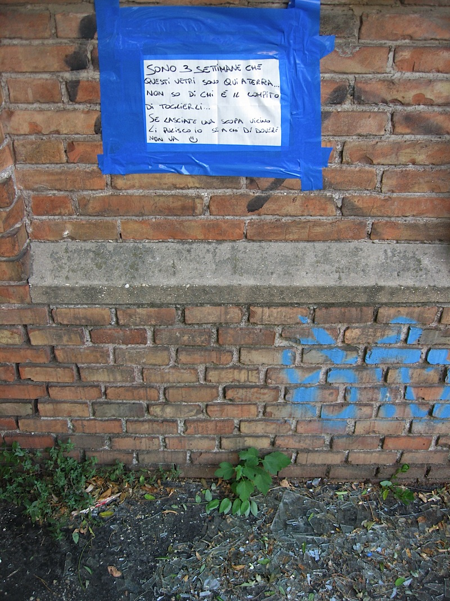

---
title: 'Scenes from Roman Life 19'
published: true
date: '04-07-2009 07:26'
taxonomy:
    category:
        - blog
    tag:
        - General
summary:
    enabled: '1'
subhead: " "
header_image: '0'
--- 

{.center} 

The sign says: _It is three weeks that this glass is here on the ground. I don't know who has the job of removing it ... If you leave a broom near here, I will clean it, if whoever ought to do it doesn't come._ That may be a smiley too. It went up on Wednesday, but I didn't have my camera. I snapped it on Thursday, but I didn't have the time. It is still there today, and so is the glass.

Here's the part I don't understand. Someone had a big piece of paper, a thick black marker, and a roll of fat blue tape, but they didn't have a broom? If the authorities haven't swept it yet, and they come by, are they going to leave the broom, rather than grab the glass? It's really art, but I don't understand it? I mean, WTF?
