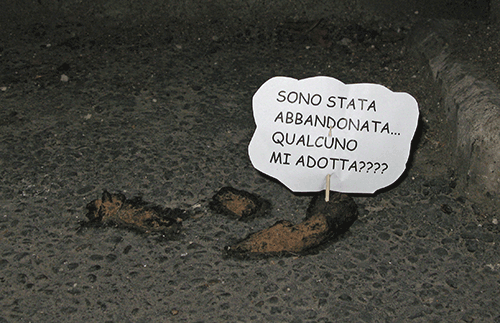
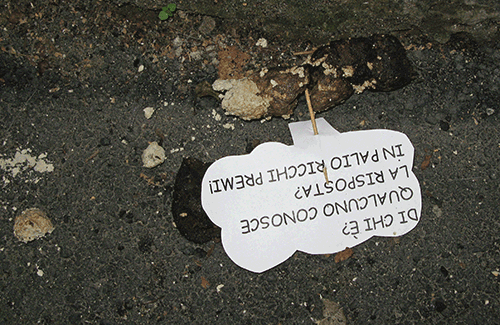

## It's crap; is it also art?

Walking down to visit a friend last night, I spotted something odd on the pavement. Holy crap, I thought, I need to get a picture of that. Nobody will believe me.

{.center}

Yes, that's dogshit. Yes, that's a beautifully lettered sign stuck in it on a toothpick. It reads, roughly, “I have been abandoned. Will someone adopt me????”[^fn1]

I took the photo very early this morning, hence the somewhat poor quality. And in the dawn’s early light, I noticed another, whose sign had alas fallen in the night. “Whose am I? Does anyone know the answer? Rich prizes up for grabs!”

{.center}

Rome is a messy, grubby town, littered with plastic bags, free newspapers and the flyers that are stuck under every windscreen wiper. And dogshit. An ordinance requiring people to scoop their poop is honoured in very peculiar fashion; one sees colourful little bags of poop abandoned on the pavement like the turds themselves. Weird.

Anyway, I don't know what to make of these inspired signs. Are they art? Are they intended to prick the conscience of lax dog owners? If the ghost of [Piero Manzoni](https://en.wikipedia.org/wiki/Artist%27s_Shit) currently stalking the streets of Trastevere is reading this, please tell me what it is all about. Se sei il fantasma di Piero Manzoni, mi dica cosa si tratta.

[^fn1]: A nice play on the campaigns to suggest that Italians don’t abandon their dogs when they head off on their hols. 
