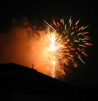

---
title: 'Scenes from Roman Life 4'
published: true
date: '03-07-2006 21:30'
taxonomy:
    category:
        - blog
    tag:
        - Glory
summary:
    enabled: '1'
subhead: " "
header_image: '0'
--- 
{.left} Sitting quietly geeking at my desk, 11 pm last Thursday night. It's been a quiet day, a Roman Holiday, SS Peter and Paul. We've been at work, though, because our gaff is outside Rome and has its own saints to take care of it. Boom! I've been watching season 2 of 24, and my instinct is to look butch and hide under my desk. But I fight that, go out onto the balcony, and am entertained by a wonderful gut-shaking display emanating from one block over, just across the river. Because just across the river is San Paolo fuori le mura, and if anyone is entitled to celebrate the day, it is the basilica. And of course I wasn't here at this time last year, so was completely unprepared. What a treat.

Happy Independence Day Friends Across The Water.