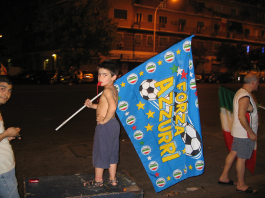

 

Gave up my World Cup virginity in the nicest company, and there was much whooping and hollering when Italy rammed one in in the closing minutes. The second, a lovely little chip over the goalie, made victory even sweeter. Cycled home through streets packed with flag-waving jubilation. The sight, however, is as nothing to the sound. Cacophony does not begin to describe it. And it went on for at least four hours after the final whistle. Even (especially?) in out of the way residential areas like mine. It’s the classic Italian thoughtlessness, rather than selfishness, and I really can’t begrudge them it. Looking forward to Sunday.
