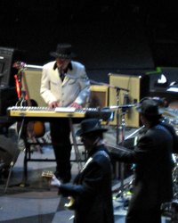

{.left} I dunno. You wait 28 years for a Bob Dylan concert and then two come along in 8 months. Outdoors at the Auditorium and most entertaining it was too. First off, Italians slow-handclapping because The Man had not appeared by 10 past the appointed hour. How ironic is that? To be honest, their hearts didn’t really seem in the slow-handclap, as they kept speeding up, and fizzling out. Then there was the lone buffoon waving a solitary cigarette lighter during, I think, Don’t think twice. Best of all, though, massive bursts of applause every time Bob picked up, or put down, his harmonica. A real sense of history.

His Bobness looked sharp, sharper than I could capture, in iconic black and white western jacket. And were those rhinestones glittering around his collar? He played many good tunes, almost all of them unrecognizable until you caught a few words. (Highway 61 an honourable and thrilling exception). But, and I don’t mean to carp, while it was a good evening, it wasn’t that good. The band just weren’t tight. Not loose; that would have been OK, obviously. Just not very together. There were a handful of occasions when everything half fell apart for a beat or two, as if nobody was sure where to go next. Certainly not as good as in [Zurich last November](https://jeremycherfas.net/blog/easyjet-set/). But I’m still glad I went.
