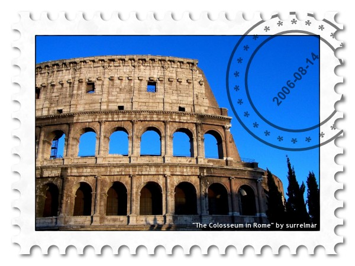

{.center}

**At the Post Office:**

Me: Good morning. I’d like five 80 cent priority stamps please.

Man behind counter: I’ll see. (_Wanders off_)

Me: (_Drums fingers. Looks at scraps of paper on counter. Glances at watch._)

MBC: (_Wanders back._) We don’t have any.

Me: (_Voice a tad squeaky, incredulous._) You don’t have any? Stamps, at the Post Office?

MBC: No.

Me: What should I do?

MBC: Bring the letters here and I will put a stamp on.

Me: But I don’t have time to come to the Post Office most days. I have to work. Today is a holiday for me. That’s why I can come to the Post Office.

MBC: Beh!

Me: Don’t you have any other stamps? Like, say, a 50 cent and a 30 cent?

MBC: (_Thinks hard. Patient with moron._) I have stamps for 1 euro.

Me: Why should I pay 1 euro when the cost is 80 cents?

MBC: Beh!

Me: Thank you. (_Turns on heel, exits._)
