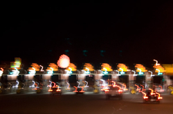

{.left} Sunday evening, on the way home from a day trip up-country, and the traffic is intense. Bad enough. Then we approach the first of the tollbooths on the way home and the Italians, desperate as ever to Get Ahead, are cruising up any empty lane, assuming they can squeeze in later to where they want to be. I’m already in the lane where I want to be, the Telepass lane, which affords me endless pleasure and is well worth the rent I have to pay on the little transponder as it whisks me pass the queues and on my way. In front of me is one of those get-ahead types, and to his right is a line of cars studiously ignoring him and failing to make room. For all of 10 seconds, max, he sits there, then edges in.

During that brief hiatus the cretin behind me issues a sharp little burst of hooting. Maybe he can’t see that I am waiting for the guy in front of me who is waiting for the guys to the right of him to let him in. But he has to hoot. I turn around, give him my best slow, incomprehending stare. Then I edge forward, as slowly as I can possibly go. I almost stall. He is a couple of centimetres behind my rear bumper. I steal a glance. He seems impassive.  But not contrite. I continue to crawl towards the barrier. The transponder bleeps, the barrier goes up, and off I speed into the gathering twilight.

Immensely childish. And immensely satisfying.

flickr photo by [optically active](http://flickr.com/photos/opticallyactive/).
