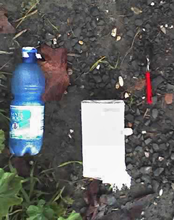

{.left} Burned spoon, pack of bicarbonate of soda, pop bottle with a silver foil lid. A lovely slim little knife was there too, but I had already picked it up before I snapped the picture. I didn't need to call in _CSI: Rome_ to know what had been going on. Drugs! No surprise, really; down on the wasteland by the river syringes are common, needles slightly less so, and furtive knots of people not unknown. It’s just a fact of life. I did wonder about two things. What disturbed them, that they had time to abandon their stuff more or less neatly? And why were they so close to the gate, less than 20 metres? Maybe the two were linked.

What really pisses me off about that piece of wasteland is that while a terrific effort was put into [cleaning it up](https://jeremycherfas.net/blog/all-cleaned-up/) last autumn, nothing has been done since, just as I feared. The first new shack appeared last week. Would that have happened if it had been kept at least a little tidy? I think it was Walt Disney who discovered that if you keep the grounds spotlessly clean, visitors will carry their mess until they find a bin, though I can’t now find a reference. Anyway, it seems to me that if the Commune had only devoted a couple of person-hours every couple of weeks to driving a ride-on mower around the site, it would quickly have become a lot pleasanter. Heck, I would have done it myself, given the mower.

OK, junkies need somewhere to fix and the homeless somewhere to live, but both could do better elsewhere. The shacks are often flooded, and clearly something sometimes happens to scare the junkies off. A rough park for local people and their dogs would be such an asset.
