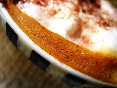

  

{.left} 

_7:43 am._ I am standing at the bar, doing a cappuccino and cornetto. In walks the milk delivery man. Short, wiry, sparse sandy hair and blue eyes. Not very Italian, if you get my drift. He's lugging two crates full of milk. His truck is parked outside. Double parked, obviously. He drops the crates, heads out. Meanwhile, the _barrista_ takes down a glass, rinses it under the tap, pours a large slug of brandy, and sets it on the back counter. Milk delivery comes back, wheeling a sack truck piled with full crates. He stacks the cartons from the crates into the chiller, loads the empty crates onto the sack truck, pauses briefly, downs the brandy and heads back to the sack truck. Not a word has passed between him and the _barrista_. And I'm left wondering whether I have just witnessed the Italian Charles Bukowski gathering material for his next story.

Flickr photo by [soozika](http://flickr.com/photos/soozika/)