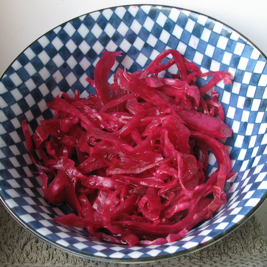

Spent this morning in the kitchen, doing three things.

A new batch of [peanut butter cookies](https://jeremycherfas.net/blog/reverse-engineering-a-loaf/). 

  * _Hypothesis_: They'll be as good or better, made with peanuts finely chopped in my fine chopper instead of peanut butter.
  * _Method_: Follow recipe, but substitute 265 gm finely chopped salted peanuts for 265 gm peanut butter.
  * _Results_: They are as good, or better.
  * _Methodological flaws_: Judgement based on memory rather than simultaneous double-blind assessment.
  * _However_: Two relatively independent judges concur fully.

Two starters and but a single loaf.

  * _Hypothesis_: There's no difference between my [home-made ??-year-old sourdough starter](https://www.jeremycherfas.net/blog/practical-microbiology-101) and the [Tuscan centenarian](https://jeremycherfas.net/blog/stories-to-savour/) I was entrusted with some time ago.
  * _Method_ (for 1st experiment): Use identical amounts of each starter to bake the standard loaf as suggested by the suppliers of the Tuscan pasta madre. [^fn1]
  * _Results_: The two _bigas_ (or should that be _bige_?) look and smell identical. More tomorrow.
  * _Methodological flaws_: The Tuscan starter begins life stiffer (75%) than my own (100%), and this time contained a couple of flax seeds left over from the last bake.
  * _However_: Get real.

{.center}

Fermented cabbage can repeat.

  * _Hypothesis_: Last month's sauerkraut was not a one-hit wonder. [^fn2]
  * _Method_: Do it again.
  * _Results_: For now, the jar is packed. Come back in about three weeks.
  * _Methodological flaws_: This time I added caraway seeds and peppercorns, and I left out the red cabbage. I also severely misjudged the amount of cabbage needed, so the jar is only half full.
  * _However_: Maybe none of that will matter.

[^fn1]: You can guess what the 2nd experiment might be. 
[^fn2]: Too busy to blog it, but boy it was good.
