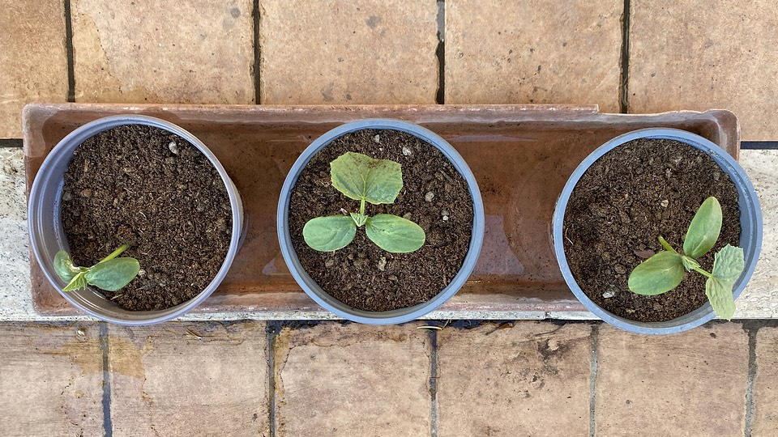

---
title: 'Seed Stories in Brief'
published: true
date: '21-06-2020 12:20'
taxonomy:
    category:
        - blog
    tag:
        - General
summary:
    enabled: '1'
subhead: " "
header_image: '0'
--- 

[{.center}](cucumber-seedlings-1920.jpg)

Just caught up with the podcast version of Dan Saladino's excellent [Seed Stories from the Lockdown](https://www.bbc.co.uk/programmes/m000k1c8) on Radio 4's The Food Programme, and of course it prompted a flood of emotions, reminiscences and recognitions. As soon as I got home, I walked through the terrace, thinking about which of the plants I had grown from seed and, more particularly, home-saved seed.

===

There's the dill, the Cupani sweet peas and Grandpa Ott's morning glory, the flower that launched Seed Savers Exchange. There are two kinds of tomato, Pugliese Stays Green and the strange brown-fruited variety that The Main Squeeze takes care of. Ancho peppers saved last year need planting out very soon, and the velvety sunflowers that look like they're coated with Vantablack are growing like crazy. The nasturtiums volunteer crazily all over the place, and then there are the wisteria and the yellow trumpetbush, grown from seed that I gathered but that have not yet produced seeds of their own. And that's not counting the things I have multiplied by vegetative propagation.

Each and every one of them gives me the same immeasurable joy every year. They're a far cry from food security, but they're pretty great for mental security.

And right after doing that, I made [a thing over at Eat This Podcast](https://www.eatthispodcast.com/seeds/).

