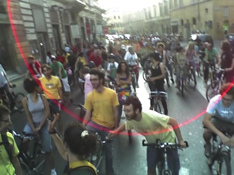
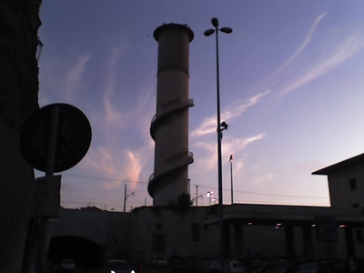

This is odd. Last night I went on the [Critical Mass Rome](https://www.tmcrew.org/eco/bike/criticalmassroma/index_old.html) bike ride again, and it was a very pleasant, sedate affair. We pedaled slowly along the Lungotevere and up the via Cavour (and elsewhere) notably to give people on motorized two-wheelers a hard time.

===

Anyway, I was going to contrast it with last month’s Friday evening ride, an entirely different affair. In my mind I had written that post, about the incredible sensation of turning onto the Tangenziale, normally a motorized hell through the city, a solid mass of 1500 cyclists swooping along at high speed across all three lanes. And all credit to the smart and sassy “leaders” (scare quotes because, of course, Critical Mass has no leaders) who blocked the cars for long enough to let the phalanx pedal off the slip road and onto the main carriageway. The feeling of power, of togetherness, of accomplishment, of entitlement, was almost overwhelming.

I imagine that’s just a little bit like what it might feel like to be a member of an oppressed minority suddenly in a majority: women, blacks, gays, have all had that feeling. I finally understood what they were talking about. And, as I say, I had definitely written the post, except that I hadn’t. It's all there in [yesterday’s fact No. 5](https://jeremycherfas.net/blog/goosed). 

{.center}

Last night was not like that. No samba cart. No tandems. No discobici. A couple of unicycles, it is true, and some very odd looking homebuilt contraptions, but none of the fizz. It was still very pleasant to be in a crowd of like-minded people, owning, even temporarily, that which we are always denied. But it wasn’t quite so exhilarating.

The cars and bigger vehicles were, as usual, reasonably good natured about the whole thing, with the exception of a few self-important fat-cat bigmobiles. It is the two-wheelers that really piss me off. They are so incredibly impatient, so rude, so willing to risk hurting a cyclist, so vulnerable themselves. There’s fine sport to be had, forming a cocoon around one of the worms and then cycling as slowly as possible without giving them any opportunity to accelerate out. And the worst of all, by far, no survey needed, are the men with a woman on pillion. So I have a question: do women really find posturing faquads attractive? Surely not. We’re doomed, I tell you, doomed.

Riding home, out of the pack, is scary, and vulnerable. But you do get to see some sights!

{.center}
