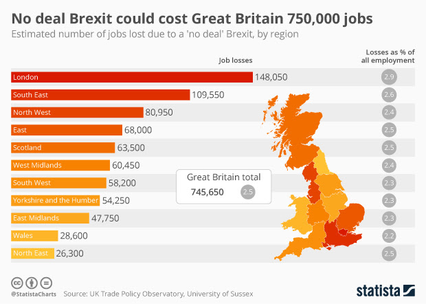

These two posts by John Naughton really need to be taken together.

First, [Sovereignty – Brexit style](https://memex.naughtons.org/archives/2018/12/07/26317): 

> *Sovereignty*, n. The untrammelled right to do self-harm.

And then, six days later, [Self-harm in a chart](https://memex.naughtons.org/archives/2018/12/13/26346):

{.center}

But John doesn't seem to draw the conclusion I do, which is that if the prediction of job losses comes about, a lot of people in the least affected areas might actually think justice had been done to the elitist wankers.
