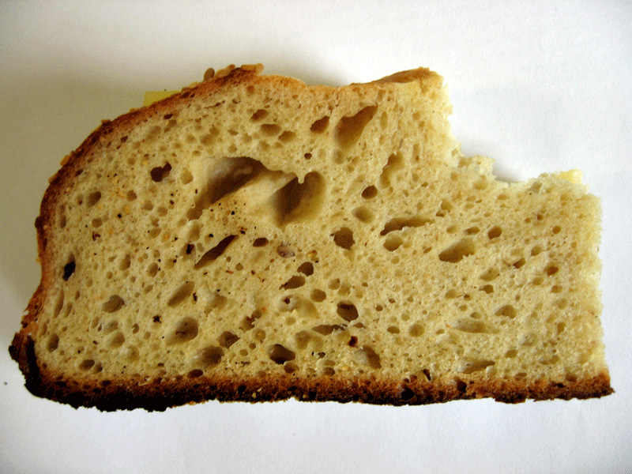

One of my favourite recipes in Bernard Clayton Jr's _Complete Book of Breads_ is Oatmeal Sesame Bread. The crumb is delicious and moist, from the oatmeal, and great for sandwiches. So I decided to convert it to weights and to use a sourdough starter.

{.center} 

I wrote it up over at the other place: [Sesame oatmeal bread](https://www.fornacalia.com/2009/sesame-oatmeal-bread/)