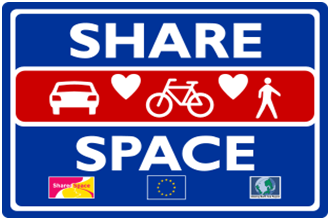

> Imagine an urban street packed with shops, perhaps a school, pedestrians and traffic all living harmoniously together in an environment where everyone feels happy, safe and relaxed. Picture a street where everyone is equal, where everyone shares the same rules, whether on foot, in a car or on a bike.

{.left} No need to imagine! I live in such a place, except perhaps the harmoniously happy part. And everyone does indeed share the same rule: **Up Yours!**

Ulf-Brün Drechsel, who waxes lyrical about [northern Europe’s Shared Space experiments](https://web.archive.org/web/20110802035417/http://www.siegelgale.com:80/blog/a-forest-of-sign-poststaken-down/) over at Siegel+Gale should come to the the Eternal City. Drivers think nothing of triple parking, or blocking the pavement completely if there’s no space on the street. Pedestrians saunter across traffic lights that are against them. One-way streets are for losers, and red lights more advice than injunction. Cars -- and [buses driven by the police](https://roma.corriere.it/roma/notizie/cronaca/11_gennaio_21/pullman-penitenziario-investe-10-persone-181302813301.shtml) -- weave like two-wheelers, with dire consequences. [No-one is safe](https://roma.corriere.it/roma/notizie/cronaca/11_gennaio_17/autocivetta-polizia-investe-barbone%20-181270739381.shtml?fr=correlati).

In London I used to happily and harmoniously ride my bike around Hyde Park Corner, before they put in those silly traffic lights. In Rome, I’m not at all happy even on the quieter little streets. Share the Space? Riiiiight!
