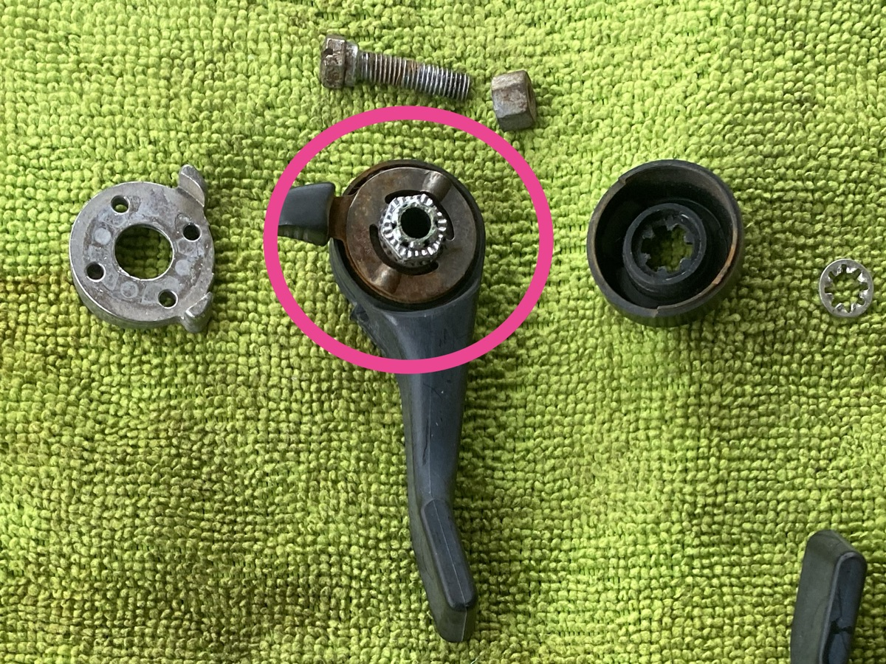
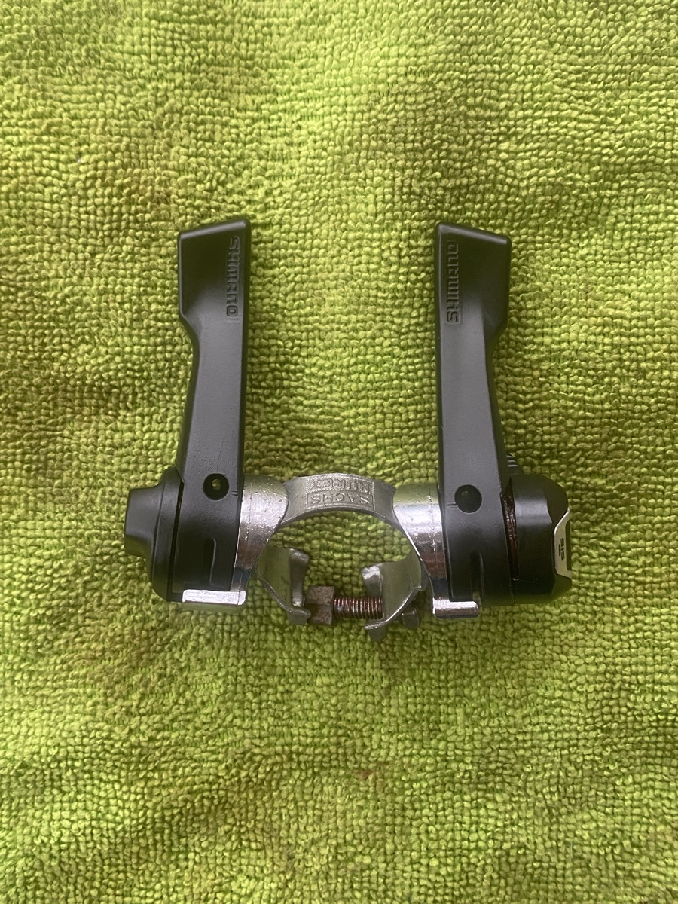

Moved on to the downtube shifters, which are a bit of a mess. The clamp is Huret-Sachs, the shifters Shimano SY20, a very early index shifter that I dimly recall asking the bike shop to fit for me. YouTube told me that the clamp probably had to be re-tapped to accomodate the larger Shimano bolts. Anyway ...

===

{.center}

The biggest problem was the index mechanism itself (circled). It is pretty rusty, and there was no easy way to remove the nut. I tried to force a bit of grease between the two plates, and maybe that helped a bit, but moving the lever is still quite gritty. Least satisfactory restoration to date.

I have asked for help on Reddit, and the answer may be a new set of shifters. I'm not too bothered about keeping everything original, as I know these shifters are not original, but the cost soon mounts up, so I would rather avoid that.

Not much more to do on components; the bottom bracket, clean the front fork, paint the frame, the wheels (not sure about the cassette; might get that and truing the wheels done by a professional), replacement bearings for sure.

{.center}

Not much difference visually, and only a slight mechanical improvement.