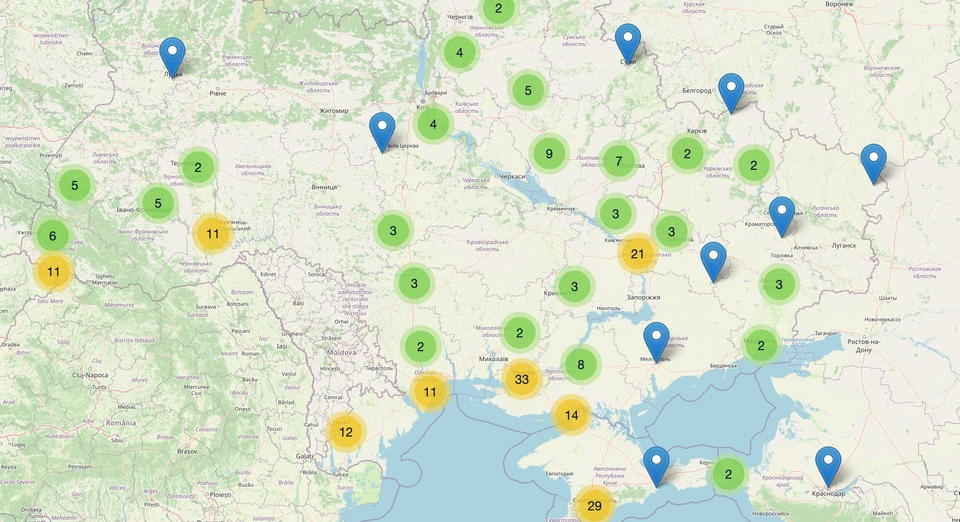
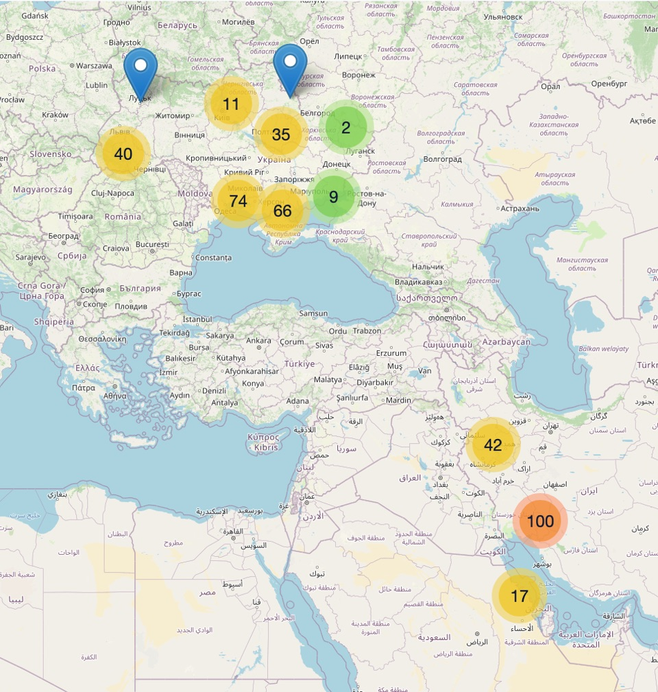

With the sudden interest in Ukraine's national genebank in Kharkiv which, as yet, [has not been destroyed](https://agro.biodiver.se/2022/05/ukraine-national-genebank-endures/), it seemed like a good idea to take a look at the diversity it holds and how much of it is duplicated elsewhere. 

===

{.center}

Clustered locations for georeferenced accessions of crop diversity collected in Ukraine

[Wikipedia](https://en.wikipedia.org/wiki/National_Gene_Bank_of_Plants_of_Ukraine) says that in early 2021 it contained “151,300 specimens belonging to 544 crops and 1,802 species of plants”. I have not been able to access the genebank's own database, but I did manage to consult two other databases. One is the list maintained by the [Svalbard Global Seed Vault](https://seedvault.nordgen.org). The other is [Genesys](https://www.genesys-pgr.org), which is a database of genebank databases under the aegis of the Global Crop Diversity Trust and which contains information on more than four million genebank accessions.[^1]

[^1]: Nomenclature presents problems. An accession is not necessarily the same as a sample. Two genebanks may each have their own accessions of a particular sample. And sample may sometimes be mistakenly used to mean accession. As for specimens, meaningless in this context. Only pedants really care, but they care a lot.

Svalbard contains 2782 accessions from Ukraine's national genebank, deposited there for safe keeping. The vast majority (1776, 64%) were collected in Ukraine. Another 567 (20%) were collected in Russia, followed by dribs and drabs from 46 other countries. Of the varieties from Ukraine, bread wheat (_Triticum aestivum_) and durum wheat (_T durum_) dominate, with 762 (43%) and 64 (3.6%) accessions, but beans are well-represented too, with 237 (13%) haricot beans (_Phaseolus vulgaris_) and a further 554 (31%) _Phaseolus_ species. Surprisingly, at least to me; no sunflowers.

Is this a reasonable subset of the overall holdings of the institute? Hard to say, but the Genesys data indicate a total of 34,532 accessions held by the Ukrainian national genebank and collected in Ukraine. Of these, 7840 (23%) are bread wheat, 1402 (4%) are durum wheat, 1855 (5%) are haricot beans. Only 521 (1.5%) are sunflowers.

At first glance, then, Svalbard is looking after a bigger proportion of Ukraine's bread wheats and, especially, beans, about the same proportion of durum wheats, and no sunflowers. But Svalbard is only one of the places where Ukraine has sent safety duplicates. Here, though, the Genesys database let me down. It reveals that only 447 accessions have been sent elsewhere, and only 100 of those to Svalbard. That is really no help, and while safety duplicates are crucial, I choose to be heartened by the Svalbard figures rather than disappointed by those reported to Genesys. And yet …

“The more genebanks holding this material, the better!,” said one person on Twitter. 

When it comes to safety duplicates, however, it ain’t necessarily so. 

“Not really,” I replied. “Most genebanks are short of resources. To have everything everywhere is wasteful. Two duplicates is plenty if everyone cooperates properly as an integrated system.”

Big if, I recognise that. But I can dream.

The data from Genesys does reveal some other aspects of Ukraine's collection. The earliest accessions are some lentils, apparently collected in 1900, while the most recent are two cucumbers collected in 2016. It can be fun for a genebank geek and agrobiodiversity lover to plumb the depths; to see the taxonomic splitters hard at work, yet unable to identify nine accessions even to family; to marvel at a spelling mistake perpetuated through 62 different accessions; to note that only 62 entries (a coincidence, I am sure) have been classified as annual, biennial or perennial. Etc. Etc.

A final quirk: Only 402 accessions offer the latitude and longitude where they were collected, but despite the Country of Origin of every accession being Ukraine, 159 appear to be well outside its borders. 

{.center}

Map of clustered collection locations for all georeferenced material in Ukraine national genebank showing obviously incorrect data

I checked a couple; latitude and longitude have clearly been swapped. An accession from somewhere south-southwest of Tehran in Iran must actually be from Cherkasy Oblast in Ukraine.[^2] You're welcome.

[^2]: I should point out that the data from Ukraine in Genesys comes indirectly _via_ [Eurisco](https://eurisco.ipk-gatersleben.de/apex/f?p=103:1:0:::::), which aggregates data from about 400 institutes in 43 countries. Eurisco and Genesys are both essentially clearing houses; they make the country data available to others to search, but they do not (cannot, by the terms of their agreements) adjust the data in any way. That is up to the supplying genebank, and right now, in Kharkiv, they have many other things to worry about.
