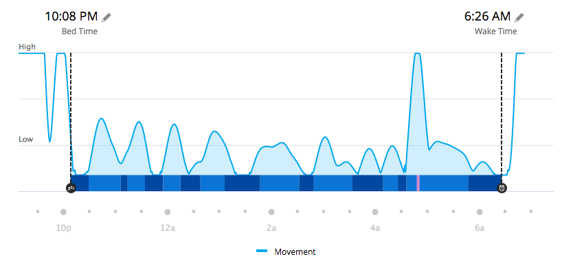

About this time last year, I started taking a melatonin pill every night before bed. I had long used it for jet lag, but I think it was reading [Gwern’s lengthy analysis](https://www.gwern.net/Melatonin) that prompted me to try it on the regular. I began doing that a year or so ago, and at some point roughly 200 days ago I switched from a 3 mg dose to a 1 mg dose. How do I know? Because my second bottle of 200 tablets was just delivered.

===

{.center} 

Right at the [outset](https://www.jeremycherfas.net/blog/monthly-report-2019-04) I noted as a first impression that “I do believe my sleep was deeper and less agitated, but I need to find a way to quantify that”. Later reflections echoed that impression and continued to marvel at the vividness of my dreams, and those impressions remain true a year on. But I’d still love to know whether my impression of deeper sleep, and especially of being awake less often, is mirrored in the data. I have the data, about five years of it; I just don’t know how to get at it.

Or rather, a year ago I didn’t know how to get at it. Today, searching around, I discover that [someone has built a thing](https://github.com/tcgoetz/GarminDB) that might just allow me to compare pre-melatonin to post-melatonin and lot more besides. But not today.

Perhaps the strangest observation in all this is that I seem to get up less often to pee. As far as I am aware, my liquid intake has not changed, nor has my liquid output. My hypothesis is that because I am sleeping more deeply, a slightly full bladder doesn’t wake me up as easily, and so I don’t need to empty it as often. Alternatively, I am getting up just as often, but neither my activity tracker nor my memory are recording the fact because I go straight back to sleep afterwards. I’m not sure I can distinguish those without giving up melatonin for a stretch.

