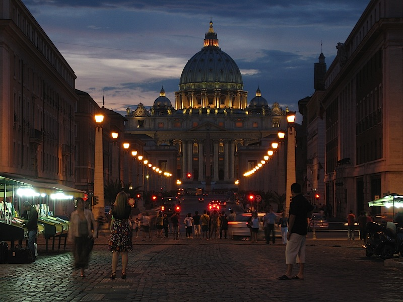

I cycled down to the Castel Sant’Angelo this evening because I’d seen a poster in the local bar advertising fireworks at 9:00 pm. Today being the Feast of SS Peter and Paul and a holiday here in Rome, that seemed entirely likely. In the event, an hour later, no fireworks had happened. I’ll have to check in the bar tomorrow that I didn’t misread the information. The evening wasn’t a washout in any case.

{.center}

The bike and the gorilla pod make a tidy combination, and as I wandered about checking out the various ethnic-tat stands down by the river I happened to look up the Via della Conciliazione at St Peter’s. That alone was worth the price of admission. Then, sitting in front of the Castel waiting for something to happen and watching people pass, I happened to glance back to see a good moon shining above the Ponte Victor Emanuele II, which was nice.

{.center}

All in all a reasonable evening, and as I write this I hear the boom of a firework, over at San Paolo Fuori le Mure. Ah well, it was a good night out anyway, and I even managed to cycle all the way up the hill past Bambin Gesu and Anita Garibaldi, who is hidden behind a shrouded scaffold. I wonder what is going on within.

