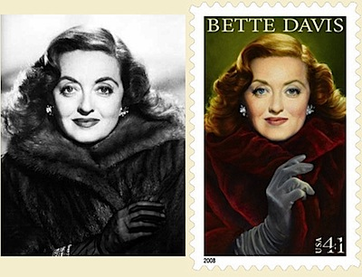

I’ve been a little bit amused by some discussion over a recent US Postal Service stamp commemorating the wonderful Bette Davis. People missed her glamorous cigarette, removed by The Authorities to protect The Little ’Uns. But the story is much, much better than that:

{.center}

The trouble is not the cigarette, which was never there, but the coat! This from the horse's mouth:

> Historical accuracy often gets pitted against political correctness. So what is an illustrator to do? Keep the cigarette, mink, or whatever in the picture, and be damned by public interest groups for encouraging vices? Or take them out, and be accused of Orwellian revisionism? It's kind of a lose/lose situation. To paraphrase Abraham Lincoln, you simply can’t please all of the people all of the time.

My thanks to [TOP for the original discussion](https://theonlinephotographer.typepad.com/the_online_photographer/2008/10/thank-you-for-s.html) and artist [Michael J. Deas](https://theonlinephotographer.typepad.com/the_online_photographer/2008/10/what-is-an-illu.html)’ explanation. He did the Columbia logo! Freakin’ awesome!
