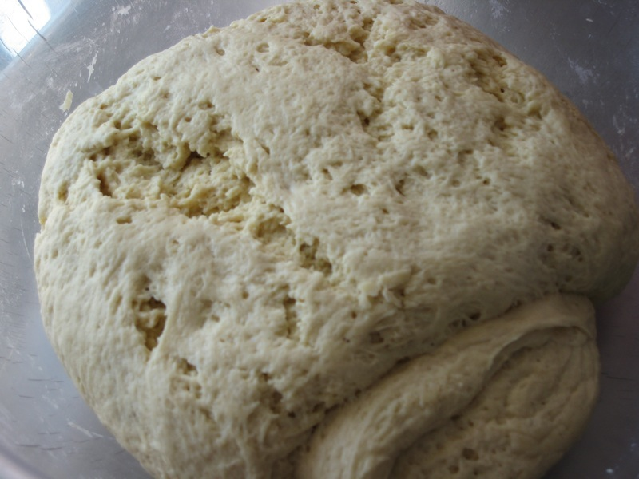
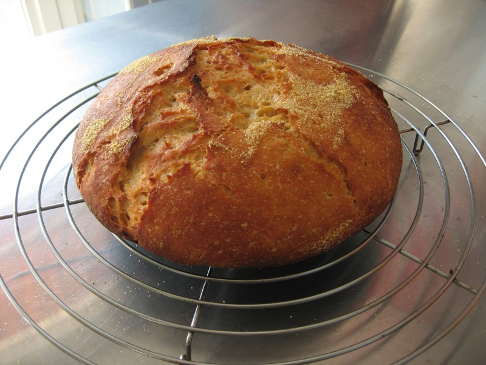
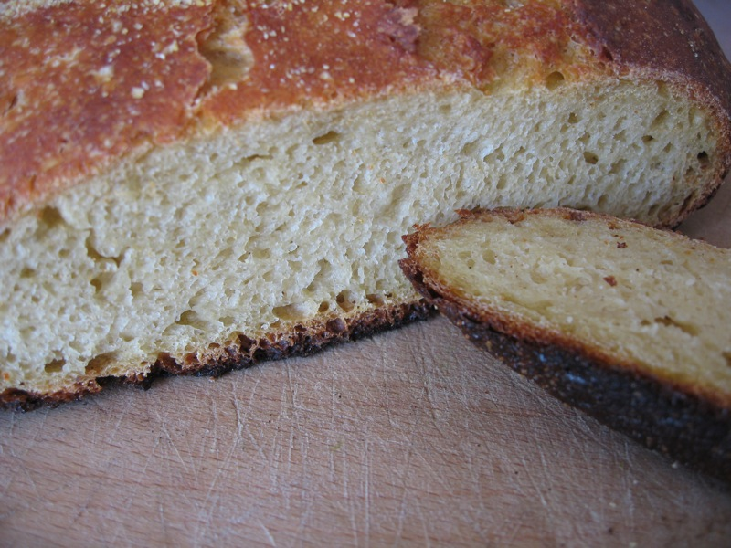

Having somewhat [grandiosely claimed](https://jeremycherfas.net/blog/who-needs-a-hobby-like-tennis-or-philately/) a couple of weeks ago that I planned to be more mindful of my breadmaking, the time has surely come to report. Last seen, I had prepared a somewhat drier dough (60% hydration) and allowed it to rest overnight. Next day, I did the gentle stretch thing three times; here it is immediately after the first stretch and fold.

{.center}

After shaping the dough into a ball I let it rise in a bowl on a tea-towel dusted with cornmeal. And then I baked it for about 45 mins in the oven on max (about 230°C), the first 30 mins under a cast iron casserole that had been heating up in the oven.

{.center}

It is pretty remarkable how the structure of the dough does change; less sticky, more elastic, shaplier, all things I had previously thought could be achieved only by “proper” kneading. The loaf itself had a great crust and not a bad crumb. On the negative side, the crumb was a little sticky and the bottom crust almost burned. Very hard, very crunchy and all in all a bit much.

{.center}

Solutions? The burned bottom might be avoided by baking overall at a lower temperature, but would that spoil the upper crust? How about if I turn the heat down 25 degrees C after the first 15 mins, as many recipes recommend? That way I should get the full spring of the rise, without burning. Or do I need a different support, instead of a metal tray a stone with much higher thermal capacity that would reach the same temperature but would not impart its heat to the bread quite so rapidly? And the stickiness? Longer baking at a lower temperature? Check the internal temperature? I'm seeing advice to go for an internal temperature somewhere between 91°C and 99°C. The advice I’m seeing, you can tell, is old-fashioned; I think I'll try for 95°C.

I have another batch doing its first rise now, and this time I’ve introduced yet another factor; autolysis, a 20 minute rest after mixing half the flour with the water, the starter, and the salt. I’m honestly not sure how much difference a 20 minute rest can make in a total fermentation of around 24 hours, but what the heck. Other people swear by it. The batch started off at 50% -- 600 grams of flour to 300 ml of water -- with about 340 grams of thick but liquid starter. It was nevertheless pretty sticky, but came together nicely after about 3 minutes of gentle kneading. I plan to leave it overnight, punch it down and shape it in the morning and do one stretch and fold before leaving it to rise in the pan all day. I’ll reduce the temperature after 15 minutes and bake to an internal temperature of 95°C. We shall see.

Like I say, so many variables, so little time.  
