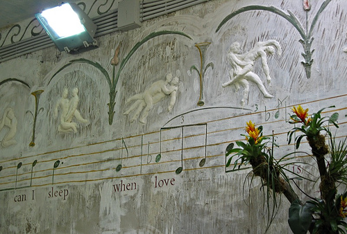

Mayday on [Ischia](https://www.google.com/maps/@40.720201,13.916931,16232m/data=!3m1!1e3), the bigger island that shares the Bay of Naples with the death-inducing Capri and sundry other rocks, for a long weekend. Stunning, simply stunning. Bad weather on day 1 didn’t matter much, as we spent most of it up to our necks in hot water at one of the many thermal baths. The pools are thoughtfully labeled not only with someone interesting from mythology but also with a temperature. Apollo at 40°C was a tad too hot, but Aurora (I think) was perfect at 38°C.

Day 2 at La Mortella, the garden created by Sir William and Susana Walton (with design help from Russell Page). This is a place I had read about often, and longed to visit, and it did not disappoint. Lush in the extreme, vertiginous, and with an almost impenetrable density of plants, it provoked one of our party to remark how wonderful it was that the rich should have created something like this to share. There are some oddities, like the very English, and to my eye not very naughty reliefs in the Temple of the Sun.

{.center}

“How can I sleep, when love is wakening,” seems to be a rhetorical kind of question that might be best ignored. It doesn’t appear to be a quote, but maybe you, gentle reader, can enlighten me. All in all, worth the entire weekend, and I believe that there are other gardens on the island one can visit, which makes a well-researched return visit attractive.

Day 3 to Sant’Angelo, an absurdly picturesque village to the south of the island, and then back to Naples and ultimately Rome.

One of the nicest things about Ischia is the transport. There are two major bus routes, one that goes clockwise round the island, the other anticlockwise, and several minor routes. Until now the number 3 tram in Rome was my touchstone of value-for-money public transport (especially before they started renovating the tracks). Now I think the CD and CS of Ischia may have displaced it.

There are selected photos at [flickr](https://www.flickr.com/photos/jcherfas/search/tags:ischia/).
