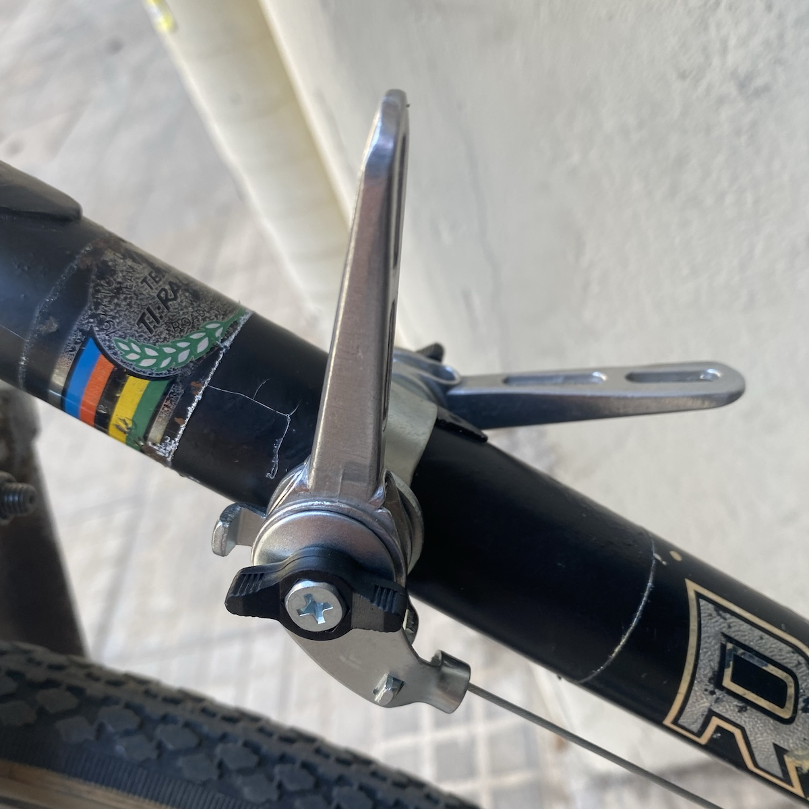
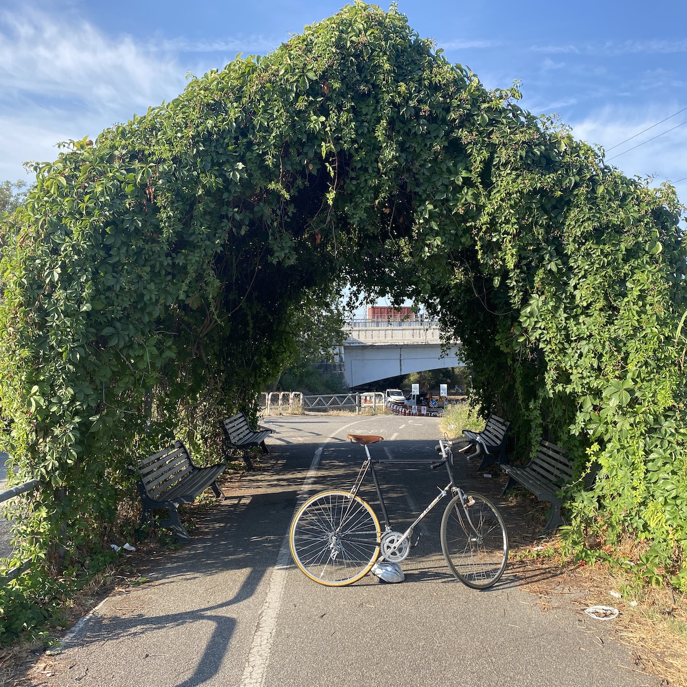

Finally, last Sunday, I set up the new friction shifters on the downtube of my old Raleigh bicycle. It’s a long story, with a happyish ending.

===

I like simple mechanicals that I can understand and tinker with. Friction shifters fit the bill,[^2] and while they worked OK the ratty old Shimano plastic ones on the bike were not great. The indexing plate on the rear shifter was rusty and corroded, and even on the non-indexed setting felt clunky. Replacements on eBay were expensive, so while I still can’t own an entire Rivendell bike, I can at least afford a pair of new Silver shifters. Just one problem: all the photos of them in action show them fitted to braze-on mounts. My frame does not have mounts, and uses a bracket that clamps around the downtube. I asked Rivendell for advice, but my question focused on the wrong part.

[^2]: Coincidentally, Rivendell’s own Grant Petersen had some [thoughts about this in his latest blahg](https://www.rivbike.com/blogs/grant-petersens-blog/july-blahg-1) (scroll down to “Here’s a thing”.)

I asked whether the threads would fit. They do. I should have asked whether they would work, i.e. maintain tension on the cables. They don’t.

When the shifters arrived I was so struck by their beauty that I went all in and ordered super luxurious Jagwire shifter cables. Installed everything and knew at once that I had made an expensive mistake. There was simply no way to tighten them enough to get the friction needed to withstand the derailleur springs. Bummer.

I spent some time looking for replacements at local bicycle shops but the two within reach had nothing suitable. All brifters or grifters or whatever. One did send me way across town (a nice ride!) to a sort of bicycle part cash and carry warehouse. At first he too said he didn’t have anything to which I could affix the Silver shifters. Eventually I asked about a complete replacement, bracket and levers. Oh yes, and back he came with a pair of SunRace levers, new, with cables, for €15.

I tried to rescue the Jagwire cables, but they were having none of it, impossible to thread them through the housing without losing two or three threads along the way. But the included cables worked fine (with the Jagwire housings, so not entirely a loss) and when I went for a spin yesterday morning, worked perfectly.[^1] They’re not as elegant nor, I’m sure, as smooth, but they do the job and I have a feeling I won’t find a better-quality replacement.

{.center}

[^1]: Well, almost. I need to adjust the reach of the front derailleur slightly, the kind of thing I could easily have done there and then with the emergency tool I carry, but I didn’t want to spoil the moment. Easier to just try the change a couple of times until it succeeds.

{.center}

Now, a dilemma. Do I keep the Silver shifters just in case I ever have a frame with brazed-on mounts? Unlikely. Do I search for a bracket with which they will work? Seems pointless. I don’t really feel I can return them; *caveat emptor* and all that. eBay? 

Best, if you’re reading this and want a pair of superb new friction shifters, let me know.