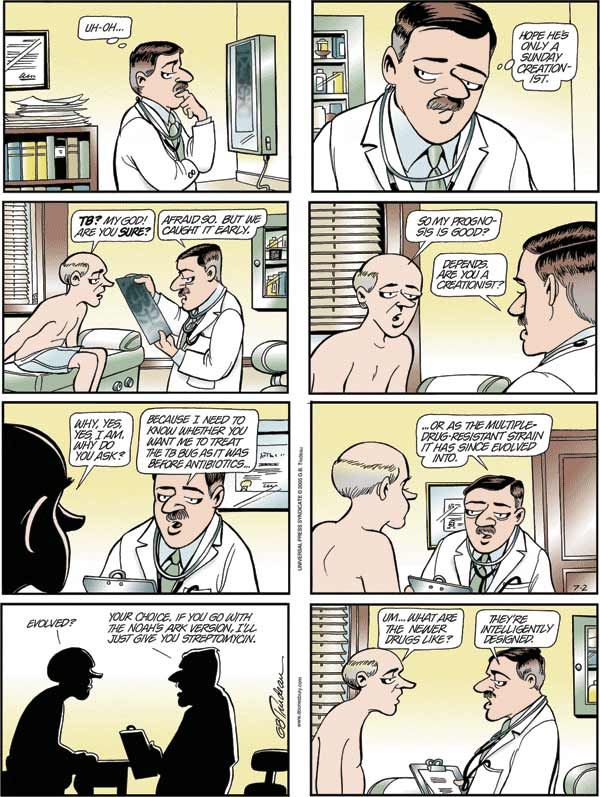

Yesterday’s Doonesbury is not funny, antibiotic resistance being one of the great unappreciated squandered commons. Well, actually it is, of course. Very. But I wonder how many people will witter on about “change within a species” and continue living a life that makes no sense except in the light of natural selection?

{.center}

Later ...  
Ooops. I learned that yesterday's strip was a repeat that was first run back in December. But that’s OK, because the loss of antibiotic susceptibility is also a repeat, and a more frequent one than Doonesbury.
