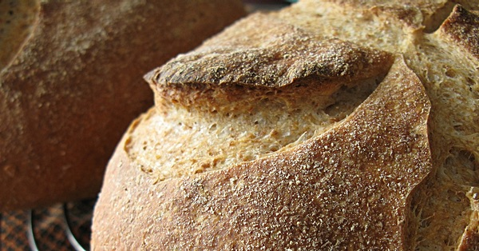

{.center}

Sourdough — whatever you call it — is the original leavening agent for breads around the world. At its simplest it is just a piece of the last batch of dough, set aside to ferment the current batch. But it can be so much more than that, a stable little ecosystem of species that support one another while keeping out intruders.

It also makes the best bread, although I admit to being biassed.

Photo is one of mine, in both senses.

<a href="https://www.eatthispodcast.com/our-daily-bread-22/" rel=canonical>Listen to Sourdough by Any Name at Eat This Podcast.</a>