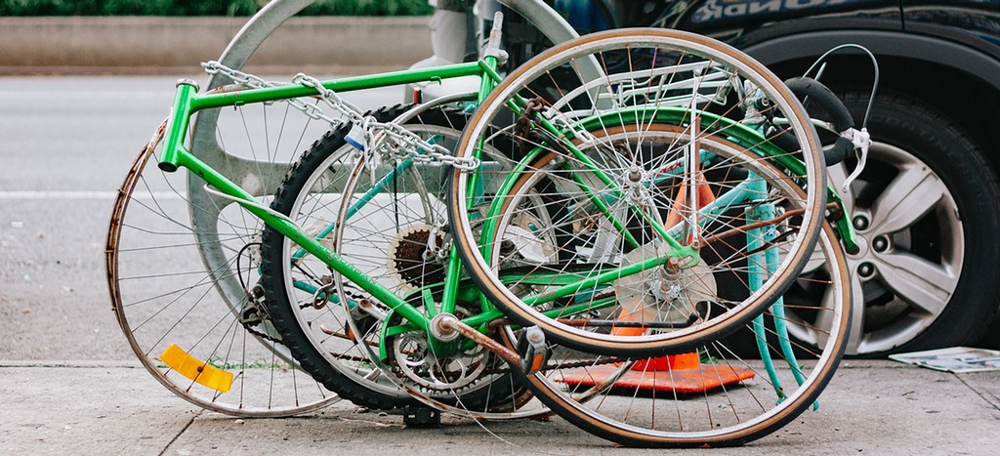

 {.center} 

As someone who mostly dislikes other people who willy-nilly connect everything they put online to everywhere they put things online in a many-to-many idiopathic echo chamber, I ought to do a little less of that myself. Or at least be a little more mindful about what I am doing.

In some ways, this is just a continuation of the soul-searching that found an outlet in [Putting my house in order: Phase 1](https://www.jeremycherfas.net/blog/putting-my-house-in-order-phase-1). I achieved some of what I set out to do there, but not enough, and this latest bout of navel gazing was prompted by a silly exchange on micro.blog.

===

Chris Aldrich wrote on his website <a class="u-in-reply-to" href="https://boffosocko.com/2018/10/10/leaving-google-for-yet-another-silo/" >warning the people fleeing Google Plus not to make the same mistake again</a >.  Chris squirted that, probably automatically, possibly by hand, to micro.blog, where I saw it. Because it didn't have a title, micro.blog truncated it, and so I went back to Chris' site to read the whole thing. There, I decided I wanted to reflect my appreciation, so I used [Omnibear](https://omnibear.com/) to Like it back to my stream, which shared it back to micro.blog.

Still with me? I hope so, because this is where it gets almost interesting. 

Because Chris' post doesn't have a title, all Omnibear can tell my site about it is that it was written by Chris Aldrich, so my entire Like post consists of Chris' name as title and a preview of the post. And the preview is illustrated by a photograph that doesn't even appear on the page I am liking, plus an automated excerpt. All micro.blog sees is my title: "Chris Aldrich". 

While Chris is a smart person who writes interesting things, that isn't going to encourage people who don't already know that to visit the link, except out of a morbid sense of curiosity

I then probably made matters worse by replying to Chris' post on micro.blog, which got fed back to his site, and on my stream, which also got fed back to Chris's site.[^1] So that, as Chris says, is "a bright spot". He also says:

> Ah yes, the problem of titleless posts and artificial character limits… Someone is going to get around to fixing those one day so that they are first class citizens, particularly in feed readers and the like.

And here we have to agree to disagree. I do not believe anyone is going to get around to fixing that any time soon. Because most people don't care. They're too busy clicking and liking and syndicating and all the rest of it. And there are probably too many variables to solve uniquely.

One of the nice things about Known, which I use for my stream of little bits and pieces, is that it allows me to offer a separate feed for each type of entry. At the moment I am sending micro.blog bookmarked pages, status updates, photos and posts and not, for example, checkins, because what's the point? A Like ends up as a bookmark, which is fine for me, and I like the idea of sharing my bookmarks partly as reciprocity for the good things I read from other people sharing their bookmarks. But there is no way automatically to distinguish well-formed bookmarks from dodgy bookmarks.

Best solution, it seems to me, is to make sure I check my version of the Like or Bookmark immediately after creating it. I usually do this to remove pointless previews, but so far that has been for the benefit only of people looking at the site, because previews are entirely local and micro.blog ignores them anyway. Knowing that micro.blog will go back and correct a syndicated post if the feed for it changes gives me an incentive to make sure that the bookmark is informative there too.

[^1]: But his reply never made it back to my stream, for reasons I don't quite have the energy to explore.

Photo by Alistair MacRobert on Unsplash