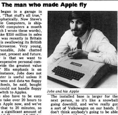

[{.left}](Jobs-Interview.png)

Almost 30 years ago to the day, _New Scientist_ magazine published an interview with the “very young and very personable Steve Jobs”. Re-reading it today, it is amazing how many of the hallmark Jobs obsessions are there. Usability, applications, meeting new needs. And perhaps the origin of why, as [The Economist](https://www.economist.com/briefing/2011/10/08/a-genius-departs) put it, “critics complained that the products and systems he designed were closed and inflexible”.

> Apple is free with specifications, so anyone can market peripherals that turn out to be rubbish. Jobs admits that a lot of the products aimed at the Apple are junk, but “it’s a free country”.

And Jobs was free to make sure rubbish was never part of the Apple experience. [^fn1]

The final paragraph looks to the future.

> “I’m really committed to putting a computer in a book. Book size. In five or six years. Sometime between 1985 and 1990 we’ll do it.” Why? “Because that’s what we want for ourselves. Everybody that works for Apple wants one.”

Not by 1990, as it happens, but in spades. And was that a touch of the royal we?

[^fn1]: Except for some of the Apple-approved garbage that now clutters the App Store. 
