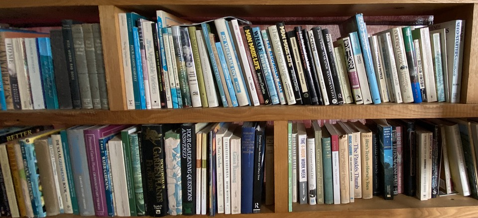

---
title: 'Structured data for book reviews'
published: true
date: '30-08-2020 17:30'
taxonomy:
    category:
        - blog
    tag:
        - Geeky
summary:
    enabled: '1'
subhead: " "
header_image: '0'
--- 

[{.center}](bookshelves-1920.jpg) 

Almost a week ago, I noted a blog post by Ana Ulin: <a class="u-in-reply-to" href="https://anaulin.org/blog/structured-book-data-in-hugo-posts/" >Adding Structured Book Data to My Blog Posts</a >. Ana added a section to the front matter of her book posts that contains information about the book in question, including her rating. She was kind enough to share her example and the partial template that displays the information on her site. Because I use Grav rather than Hugo as my CMS I couldn’t just steal Ana's template, but I was more than happy to base my front matter directly on her’s.

===

The relevant section of the YAML front matter for the latest book is:  
````
book:
	title: "All the Light We Cannot See"
	author: "Anthony Doerr"
	url: "https://bookshop.org/books/all-the-light-we-cannot-see/9781501173219"
	year: "2017"
	started: "2020-07-01"
	finished: "2020-07-23"
	rating: "5"
	image: "all-the-light-we-cannot-see.jpg"
````

And the Twig partial template is:  
````
<div class="h-cite bookcard flex" >
<div class="book-cover">
<a href={{ page.header.book.url }} class="u-uid"></a>
</div>
<p class="book-data">
<span class="p-item h-product">
<a href={{ page.header.book.url }}>{{ page.header.book.title }}</a></br>
by {{ page.header.book.author }}</br>
Published: {{ page.header.book.year }}</br>
</span>
Read from: {{ page.header.book.started|date("d M") }} to {{ page.header.book.finished|date("d M") }}</br>
<data class="p-rating" value="{{ page.header.book.rating }}">My rating: 

 🌟

</data>
</p>
</div>
````

That seems a lot more complex than the Hugo template, but it isn’t really, just different (although I am bit jealous of that `string.Repeat` function).

I’m very happy with the outcome, and I think I even got the microformats correct; thanks to Ana for inspiration. Now I “just” need to update all my existing reviews. With a snippet to inject the required details, I’m hoping it won’t take long and that I have no excuses for not writing more about the books I’ve read.

<a href="https://news.indieweb.org/en" class="u-syndication">Also posted on IndieNews</a>.
