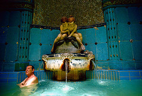

I do genuinely feel sorry for Dave Freeman, partly because 47 is just too young to die, and partly because if you’re going to tell everyone else what they should do before they die, then it can’t be a good thing not to have done it all yourself. 

===

Commentators have tried to analyse the appeal of what my friend The Wombat Eater calls before-you-die-ism. Simplicity, or “high concept” is the view of one Waterstones employee. I can see that, rather like 100 Pasta Dishes, or 50 Big Crossword Puzzles, you know what you’re getting. But I also think these books pander to the insecurity of the modern consumer. The person who lacks the skills to choose their own avocados at the supermarket, but needs someone else to pick one that’s ripe today and one that will be ready in a couple of days and package them in one easy use confection, labelling which is which of course, is also the kind of person who needs to be told to run with the bulls at Pamplona or to go to the camel fair wherever.

Wombat said “if I reflect on the things that others might add to a BYD list that I’ve already done (visiting the Taj Mahal sorts of things) they are not as satisfying as many mundane pleasures ‘a friendly welcome as a regular patron in a favourite restaurant or dining regularly with friends’.” I think he’s being a bit too quotidian. Those are fine pleasures, and no-one should die without experiencing them. But because they are so easy there really is no excuse not to enjoy them often.

{.left} And that was why, when the week’s work here was finally over, I took myself off to the baths at the Gellért Hotel. The exterior is swathed in scaffolding and Cristo-wrap, but the inside is wondrous. The diversity of human shapes on display is nothing short of jaw-dropping. And the lack of information maddening. I guess that’s the final proof that taking a bath remains a great Hungarian pleasure, but would it hurt so much to have comprehensive instructions in some other language? And an attendant who could speak something other than Hungarian would not regard handing towels to a bemused foreigner as a suitable use of their talents.

One figures it out in the end, which possibly adds to the pleasure. And some things transcend language; soaking in hot water, going into the steam room for a schwitz, chilling in the plunge pool, and doing it all over again a couple of times before having Tibor work the knots out of your body is one of them.

So, regardless of whether the Gellért hosts the best baths in Budapest, at least I’ve done those baths.

Afterwards I trekked up the hill to the Peace Statue, down the other side and along the river to the funicular, up to the Palace and finally back to the Hotel, exhausted but happy. A brief rest, after which there was only one possible thing to have for supper: foie gras and sweet tokaij. Not overlooking the Danube, but the food was the thing. Two life list ticks in one day.
