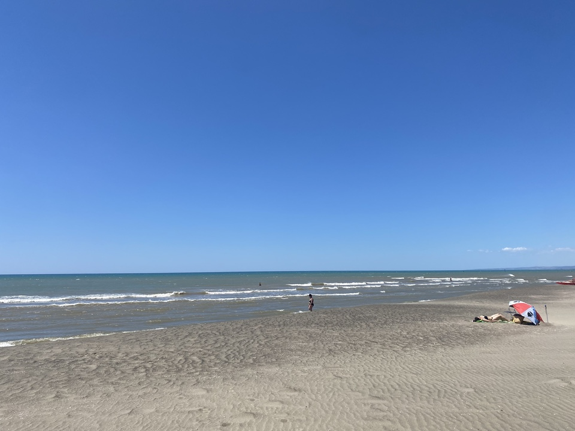

The total indifference to customer service is just one reason to close my account at UniCredit. They insist that I make an appointment. I arrive in good time. They ignore me, keep dealing with someone else with no excuse or explanation. Any minute now I know it will be time for their lunch.

I finally get to sit down opposite the manager, behind his plexiglass screen. On his computer screen, he calls forth … something. Then proceeds to squint and make little random facial gestures — grimaces, eyebrow lifts, pursed lips — for about five minutes, without saying a word. I suppose he is looking at something to do with my account, but I have no confirmation. It could be Facebook. Or tractors.

Finally, he prints out four pages of fine print that I skim and sign. Another few minutes of peering at his screen results in another piece of paper that instructs the cashier to give me my money. I note that he is deducting _pro rata_ the monthly fee of €4.79 that the bank has been charging me since this time last year for doing absolutely nothing. It is, of course, my own fault for not coming back sooner, and I can live with that.

Throughout the entire 20-minute process, at no point does he ask me why I want to take my money elsewhere and I don't volunteer the information. Finally, 50 minutes after going in, I exit, holding folding.

{.center}

It is a beautiful day, quite fresh, so we take our picnic to the beach to celebrate. Alas, it is blowing hard enough to put the sand in sandwiches. We sit for a while, consider our options, and return to eat our bread and cheese beneath the pines.
