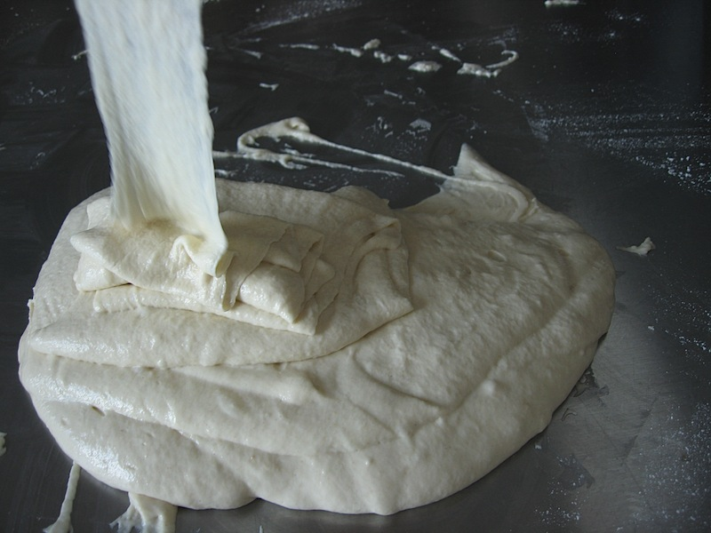
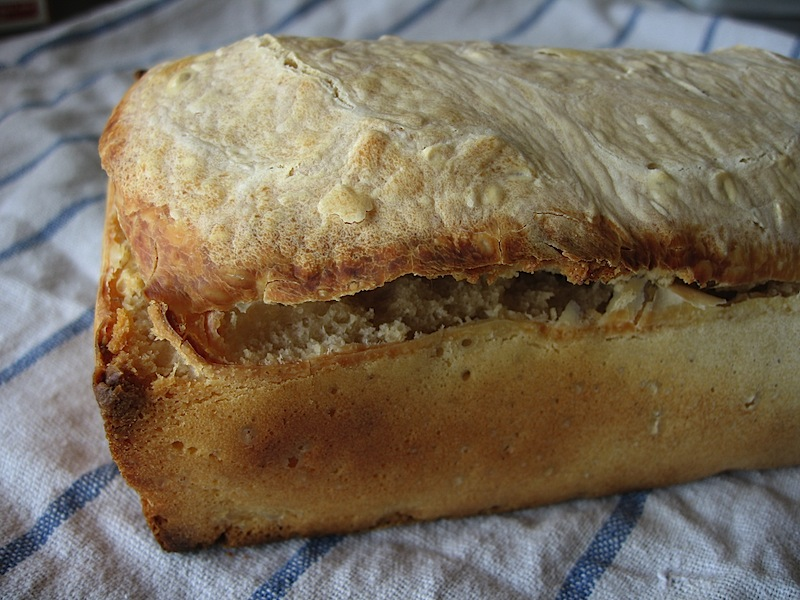

As good as my word, in search of the solution to my sticky dough issue, I made a loaf covering with a tea-towel throughout all the fermentation. The result was not good.

{.center} 

After rising overnight, the dough, which started off as a stiff 50% hydration, was once again like waffle batter, only stickier. The problem is clearly nothing to do with excess water being breathed out by the micro-organisms and condensing back into the dough. Enough theorizing; to the internets, again! Searching specifically for the influence of temperature on fermentation, I noted first of all that there is an awful lot of information out there and that an awful lot of that is too detailed for a butterfly like me to skim lightly over. I did, however, pick up two interesting ideas.

First off, at higher temperatures the dough is likely to be more acidic, and gluten softens at pH 3.7. I have pH papers, but it proved kind of tricky to get a reading from the remaining mother. (Good justification for a pH meter!)

More importantly, I think I’ve been neglecting my starter. At higher temperatures it gets too acid too quickly, and the yeasts and bacteria start to die off, releasing enzymes that combine with the low pH to make the gluten somewhat soupy. In all my years of baking sourdoughs, this is the first time I’ve really had a long-lasting problem, and it coincides not only with higher temperatures but also with using a smaller starter -- about 100 gm -- that I had been feeding with 1 tablespoon of flour and one of water roughly every day. Before, I used about 250 grams of starter and just kept it, unfed, in the fridge between loaves. I suppose I could go back to that method, but in the meantime, I’m going to try feeding the starter more, and an increasing amount, each day. I may also refrigerate it between meals.

The idea is to use about 35% of the total flour to build a really active starter before making the dough for bulk fermentation.

{.center} 

The loaf from that sticky mess pictured above barely rose, as might be expected, and then popped its top in the oven. But that’s OK because the remarkable thing in all these “failures” is that the bread still tastes pretty good. Not as good as when everything goes well, which is as much a matter of texture as flavour, but good enough. It is chewy and dense without being brickish, and sour without being overly acidic. And as I flail my way forward to recovering the perfect loaves I used to produce, I have two thoughts. Firstly, wouldn’t it be nice if there were more people to munch their way through the mistakes, allowing me to do the next experiment sooner. And if push comes to shove, I can always go back to my old methods.
