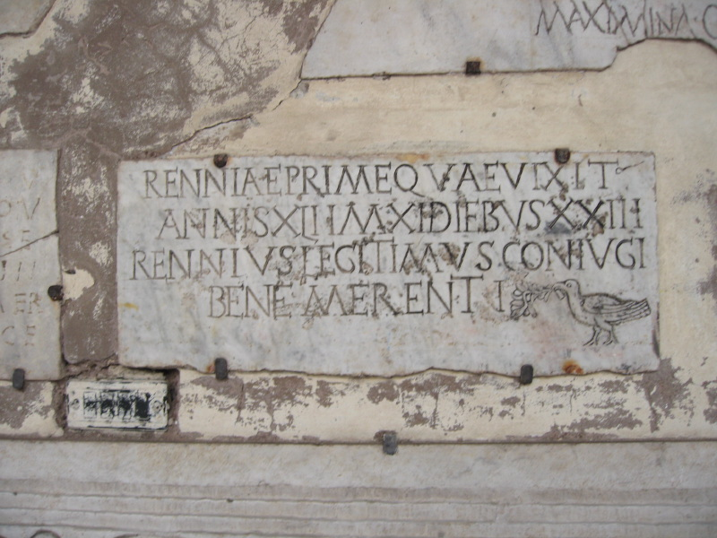

{.center}

Saturday morning found me at Santa Maria in Trastevere. Having never really paid them any attention, I found the bits of old inscription decorating the portico interesting as visual objects. So I snapped a few, focusing on those that contained birds, and very sweet they were too.

More or less simultaneously my friend Luigi’s quest to get to the bottom of a curious inscription on a Roman portrait bust has been gaining some traction, thanks to the good offices of a classicist friend at Rice University.

And as a result of that, I’ve discovered that my idle snapping of pretty inscriptions makes me [an epigrapher wannabe](https://www.flickr.com/groups/502617@N24/). As the classicist emailed, “Once you start to think about it, the city of Rome is really a museum of words, and that raises lots of interesting questions and thoughts. Attached is an article you might enjoy”.

The article was Ann Marie Yasin (2000). Displaying the sacred past: Ancient Christian inscriptions in early modern Rome International Journal of the Classical Tradition, 7 (1), 39-57 DOI: [10.1007/BF02689200](https://link.springer.com/article/10.1007/BF02689200) and it is all about the inscriptions in the portico of Santa Maria in Trastevere. They were assembled there in the early 1700s, when the current portico was built, by Marco Antonio Boldetti, canon of the church for more than 40 years and the Vatican’s Custodian of the Sacred Relics and Cemeteries.

What I certainly didn’t know, and what Ann Marie Yasin makes clear, is that the inscriptions were not merely decorative, but were objects of veneration. They connected church-goers with the history of the church but were also themselves sacred, having been touched by the bodies of matyrs (for Boldetti, all the tombs in the catacombs were of matyrs) and thus imbued with miraculous power.

As for the birds, they were one of the clearest signs to Boldetti that this was the tomb of a true martyr -- along with palm branches, glasses (drinking, not visual) and urns. What did birds “really” mean? Alas, I'm not enough of an epigrapher to know, and never will be.
