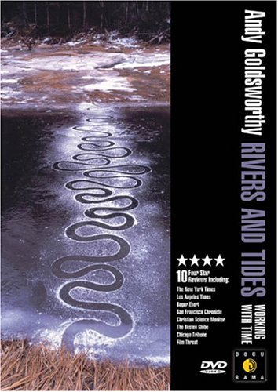

 
The Mall really is the jewel in Washington DC's crown. Not just because there are so many museums there. And not just because they are free. But being both dense and free, there's no pressure to exhaust oneself doing an entire building. One can flit in and out, take in the Italian miniatures in the East Building, the new video works over in the Hirschhorn, the choice oriental stuff over at the Sackler and still have energy left over to appreciate it all.

{.left} The best event, by far, was a noontime screening of Thomas Reidelsheimer's film "Andy Goldsworthy's Rivers & Tides". With stunning but not overbearing camera work and an ethereal but fitting soundtrack it gave me a fresh understanding not only of how Goldsworthy works but why. I've long admired his work, in the flesh as it were and in photographs, but moving pictures show an entirely new side of the works. Indeed, it changed my mind. Previously, on the basis of the still pictures, I had dismissed his attempts to fling sand and the like into the air. I mean, talk about ephemeral! But the movie reveals what the still pictures cannot, the shimmering evanescence of the effort, as backlit motes swirl and dance in the low sunlight; I wonder whether Goldsworthy himself realized just how beautiful that work was before it had been shot?

I gotta say, my enjoyment of all this was heightened by the delicious thrill of knowing that at the same time that I was enjoying my state-sanctioned and indeed government-supported exposure to the arts, my pal Neddie Jingo was just up the street, exposing hisself to the elements and freezing his ass off after [dropping $94 to visit the International House of Espionage](http://byneddiejingo.blogspot.com/2005/12/intel.html).

There are no coincidences, only conspiracies we have not yet uncovered.