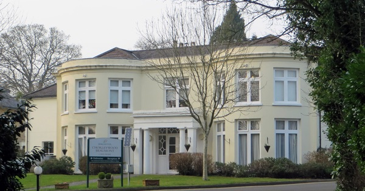

{.center}

Small bakers couldn’t compete with the giants created by Allied Bakeries, so they turned to science. That produced the Chorleywood bread process, which gave them a quicker, cheaper loaf. Unfortunately, the giant bakeries gobbled up the new method too. More and more small bakeries went out of business as a loaf of bread became cheaper and cheaper.

Was it worth it? You tell me.

<a href="https://www.eatthispodcast.com/our-daily-bread-19/" rel=canonical>Listen to The Bread that Ate the World at Eat This Podcast.</a>
