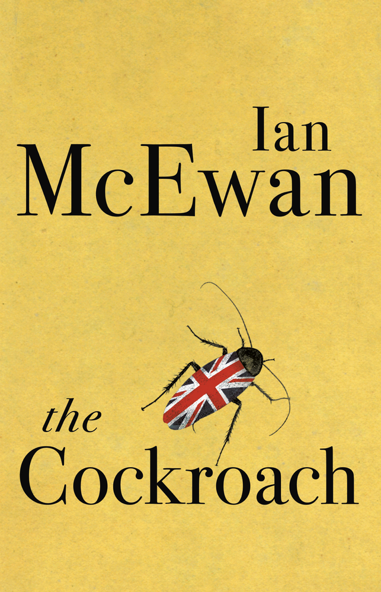

{.left}  

At the end of September, [David Runciman interviewed Ian McEwan](https://www.talkingpoliticspodcast.com/blog/2019/192-ian-mcewan) on Talking Politics. Their conversation about McEwan's two most recent books was so interesting that I went and bought both almost as soon as I got back home from my walk. I wasn't disappointed.

===

*The Cockroach* inverts (subverts?) Kafka's *The Metamorphosis* such that rather than Gregor Samsa waking up as a cockroach, a cockroach wakes up as Jim Sams, Prime Minister of the United Kingdom. Hilarity ensues as the cockroach's steely resolve accomplishes what Sams as a human never could: passing a bill to make something called Reversalism the basis of the UK economy. In essence, people have to pay to have a job, and are penalised for keeping hold of cash, so everyone will spend more and the economy will boom.

"By 2050 it is more than possible, and less than impossible, that the UK will be the greatest and most prosperous economy in Europe," Sams tells The House.

Crazed? Possibly, but hard to say. McEwan writes:

> Two significant seventeenth-century economists, Joseph Mun and Josiah Child, made passing references to the reverse circulation of money, but dismissed the idea without giving it much attention.

Did they? Josiah Child certainly existed, and became Director of the East India Company and a widely-read economist. I can find no trace of Joseph Mun. But then, why look, given that I didn't bother to ask whether a cockroach could indeed "drive this soft new machine" in which it found itself. The whole, brief novella is a glorious romp, very prescient and, in the final betrayal, perhaps even more treacherous than the actual effort to prorogue parliament, which, it must be said, McEwan's cockroach Prime Minister considers very early on in the story.

{.left} *Machines Like Me* is an altogether different kind of tale, although it too is a stunning display of extrapolating from what is to what could be. An artificial human, first of its kind, enters the life of a loser and the woman he loves.

The book is billed as science fiction, which it is, and as an alternative history, which it need not be. Mrs Thatcher loses the Falklands War and eventually has to cede power to Tony Benn. McEwan does not make very much of that, although it does give him the opportunity to put some heartfelt words into Tony Benn's mouth:

> From his new front door, Benn told the nation that there would be no rerun of the 1975 referendum. Parliament would make the decision. Only the Third Reich and other tyrannies decided policy by plebiscites and generally no good came from them.

The only reason I could see for *Machines Like Me* to be an alternative history is so that Alan Turing can survive and make the computing breakthroughs that allow the artifical humans to exist. Would a fictional Turing not have carried the same weight? That's not all he does, of course, serving also as a foil for the heavyweight discussions of what it means to be conscious, to have feelings, to be, in the end, human. And that's the really sad aspect of the artificial humans: because they are not truly conscious, and yet have monstrous computing power, they suffer, if that's the word, huge existential angst.

> Millions dying of diseases we know how to cure. Millions living in poverty when there’s enough to go around. We degrade the biosphere when we know it’s our only home. We threaten each other with nuclear weapons when we know where it could lead. We love living things but we permit a mass extinction of species. And all the rest – genocide, torture, enslavement, domestic murder, child abuse, school shootings, rape and scores of daily outrages. We live alongside this torment and aren’t amazed when we still find happiness, even love. Artificial minds are not so well defended.

There are some choice moments in the story, as humans not in the know come face to face with the machine, and McEwan has a special knack of allowing a reader to feel very clever because they have figured out a little twist just before it is revealed.

In the end the many little twists and the large ones do offer opportunities to think about consciousness and sentience, and I don't think I'm spoiling anything by one final quote.

> You tried to destroy a life. He was sentient. He had a self. How it’s produced, wet neurons, microprocessors, DNA networks, it doesn’t matter. Do you think we’re alone with our special gift? Ask any dog owner.

That hit home.

----

Ian McEwan <i>The Cockroach</i>. Jonathan Cape, 2020.

<a href="https://www.goodreads.com/review/show/3008041467">My review on Goodreads.</a>

<a href="https://www.amazon.com/Cockroach-Ian-McEwan-ebook/dp/B07Y7JB6XZ/ref=as_li_ss_tl?ie=UTF8&linkCode=ll1&tag=agricubiodivw-20&linkId=2450e9bbc52d7e7c9329d51510c4796b&language=en_US">Find it on Amazon</a>

Ian McEwan <i>Machines Like Me</i>. Jonathan Cape, 2019.

<a href="https://www.goodreads.com/review/show/3013460555">My review on Goodreads.</a>

<a href="https://www.amazon.com/Machines-Like-Me-Ian-McEwan/dp/1529111250/ref=as_li_ss_tl?_encoding=UTF8&qid=1573322223&sr=1-1&linkCode=ll1&tag=agricubiodivw-20&linkId=c260f1f9f50e37e463a2369890f6f15c&language=en_US">Find it on Amazon</a>

