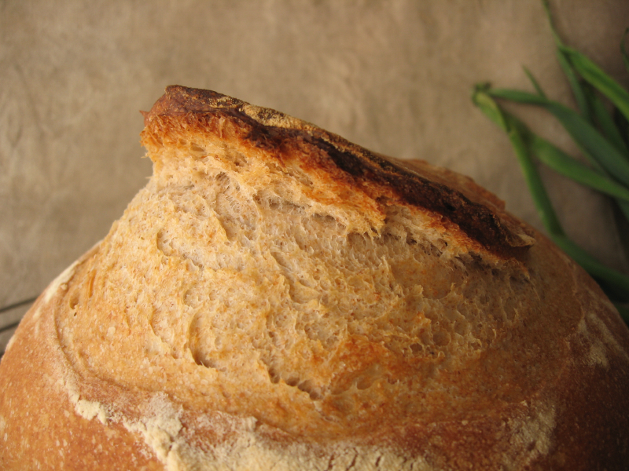
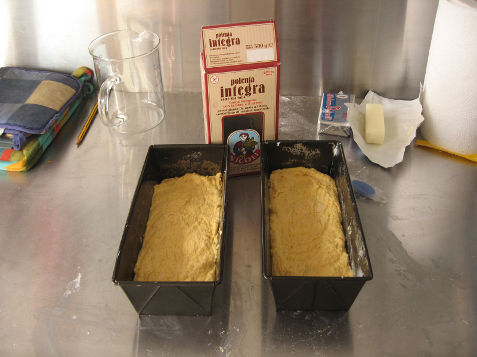
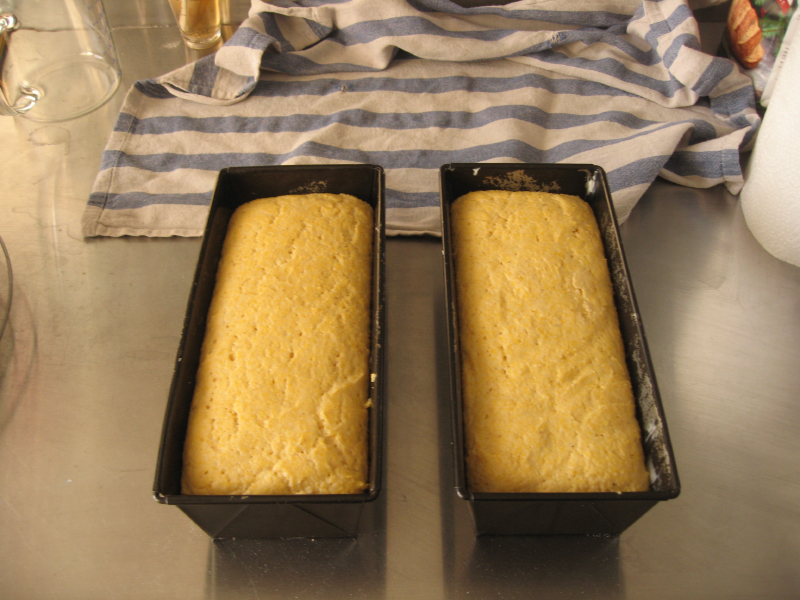

Life outside of Life has been hectic lately, which is why I am only just getting round to writing up the breads I made for a dinner on the first Saturday after [Fornacalia](https://www.jeremycherfas.net/blog/happy-fornacalia-everyone). The meal was chilli with all the fixins, and three breads.

First off, to keep the wolf from the door, thin slices of [semolina bread with millet etc](https://jeremycherfas.net/blog/hamelmans-semolina-with-a-wholegrain-soaker/). toasted and spread with a very fine paste of chopped onions in oil.

Then there was what has become my standard 33% wholemeal [pagnotto](http://jeremycherfas.net/blog/food-news-new-series-10-neo-artisans/), made with a _pasta madre_ leavened _biga_ and containing a goodly amount of sunflower and pumpkin seeds.

And finally, because what would chilli be without cornbread, cornbread. Once again, I decided to modernize an old friend, Bernard Clayton Jr's Batter Corn Bread, and here it is.

    * 2 teaspoons dried yeast (or whatever)
	* 490 grams flour (I used 00 soft flour)
	* 280 grams coarse cornmeal (I used polenta)
	* 60 grams butter, soft
	* 30 grams brown sugar
	* 10 grams salt
	* 2 eggs, lightly beaten
	* 360 grams hot water, about 50℃ (120℉)
    

  1. Get the yeast going, if you prefer it that way, in a little of the water with a pinch of the sugar.

  2. In a large bowl, pour the water over the butter, sugar, salt and beaten eggs and whisk gently to mix.

  3. Add the yeast, flour and cornmeal and beat until thoroughly mixed. The batter is stiff, but not a dough, really.

  4. Grease two medium-sized loaf pans and spoon the batter into them, pushing it into the corners with a wet spatula. Cover the pans and set them aside in a warm place until the batter has about doubled.

  5. Preheat the oven to 190℃ (375℉). Brush the tops of the loaves gently with a little milk and sprinkle lightly with cornmeal.

  6. Bake for 35-40 minutes, until a probe inserted into the centre of the loaf comes out clean. Allow the loaves to rest in the pans and cool for a few minutes, then remove and cool on a rack.

This bread is great warm, with a pretty fragile crumb, so do not be tempted to slice thinly. This is good, with good fresh butter. And chilli.

[Yeastspotting](http://www.wildyeastblog.com/category/yeastspotting/), this one's for you.
